<p align="center">
  
</p>

# Agency Skills

This repository packages specialist agent, marketing, product, scientific, and engineering workflows as Codex-compatible skills. Skills live under `skills/<group>/<skill>/`. Each skill folder has:
- `SKILL.md` containing Codex skill frontmatter and specialist instructions
- `agents/openai.yaml` containing UI metadata for skill lists and default prompts

## Install

Clone this repository into a Codex skills directory or copy selected skill folders into your existing skills path.

```bash
git clone https://github.com/bestagentkits/agency-skills.git
```

To use a skill, invoke it by name in Codex, for example:

```text
Use $engineering-backend-architect to review this API design.
Use $copywriting to improve this landing page headline.
Use $pi-agent to configure a terminal coding harness.
```

## Claude Code Plugin Marketplace

This repo ships an Anthropic Claude Code plugin marketplace catalog at `.claude-plugin/marketplace.json`.

```text
/plugin marketplace add https://github.com/bestagentkits/agency-skills.git
/plugin install agency-skills@agency-skills
```

The marketplace entry uses `strict: false` with an explicit `skills` list, so the manifest paths are the single source of truth.

## Imported Tools

Marketing integration guides and zero-dependency Node.js CLIs are available under `tools/`.

- `tools/REGISTRY.md` indexes marketing tool capabilities by category.
- `tools/integrations/` contains API and workflow guides.
- `tools/clis/` contains standalone Node.js CLI adapters imported as non-executable assets. Run selected tools with `node tools/clis/<tool>.js ...` after reviewing their operation and credentials.
- `tools/imported/` preserves commands, agents, scripts, packages, docs, plugin metadata, and other supporting assets from imported collections as non-executable reference files.

## Source Conversion

The conversion is reproducible from local checkouts of the source corpora:

```bash
AGENCY_SOURCE=/tmp/agency-source
MARKETING_SOURCE=/tmp/marketingskills-source
SCIENTIFIC_SOURCE=/tmp/scientific-agent-skills-source
BAOYU_SOURCE=/tmp/baoyu-skills-source
PM_SOURCE=/tmp/pm-skills-source
CLAUDE_SKILLS_SOURCE=/tmp/claude-skills-source
ruby scripts/convert-agents-to-skills.rb "$AGENCY_SOURCE" .
ruby scripts/import-marketing-skills.rb "$MARKETING_SOURCE" .
ruby scripts/import-external-skill-collections.rb . "$SCIENTIFIC_SOURCE" "$BAOYU_SOURCE" "$PM_SOURCE" "$CLAUDE_SKILLS_SOURCE"
ruby scripts/generate-plugin-marketplace.rb .
ruby scripts/validate-generated-skills.rb . "$AGENCY_SOURCE" "$MARKETING_SOURCE" "$SCIENTIFIC_SOURCE" "$BAOYU_SOURCE" "$PM_SOURCE" "$CLAUDE_SKILLS_SOURCE"
```

Importers preserve full skill folders under `skills/<group>/` and add `agents/openai.yaml`. Incoming slug collisions are namespaced so existing local skills are not overwritten. Imported scripts and CLIs are stored as non-executable assets.

## Skills Catalog

Total skills: **842**.

### Academic (5)

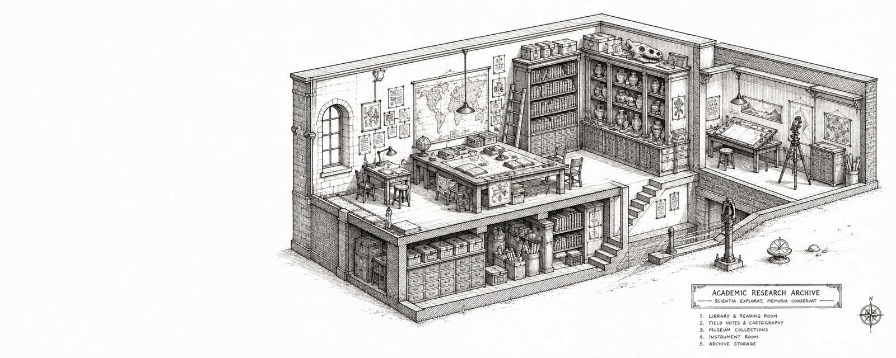

| Skill | Name |
| --- | --- |
| [`$academic-anthropologist`](skills/academic/academic-anthropologist/SKILL.md) | Anthropologist |
| [`$academic-geographer`](skills/academic/academic-geographer/SKILL.md) | Geographer |
| [`$academic-historian`](skills/academic/academic-historian/SKILL.md) | Historian |
| [`$academic-narratologist`](skills/academic/academic-narratologist/SKILL.md) | Narratologist |
| [`$academic-psychologist`](skills/academic/academic-psychologist/SKILL.md) | Psychologist |

### Baoyu Skills (21)


| Skill | Name |
| --- | --- |
| [`$baoyu-article-illustrator`](skills/baoyu-skills/baoyu-article-illustrator/SKILL.md) | Baoyu Article Illustrator |
| [`$baoyu-comic`](skills/baoyu-skills/baoyu-comic/SKILL.md) | Baoyu Comic |
| [`$baoyu-compress-image`](skills/baoyu-skills/baoyu-compress-image/SKILL.md) | Baoyu Compress Image |
| [`$baoyu-cover-image`](skills/baoyu-skills/baoyu-cover-image/SKILL.md) | Baoyu Cover Image |
| [`$baoyu-danger-gemini-web`](skills/baoyu-skills/baoyu-danger-gemini-web/SKILL.md) | Baoyu Danger Gemini Web |
| [`$baoyu-danger-x-to-markdown`](skills/baoyu-skills/baoyu-danger-x-to-markdown/SKILL.md) | Baoyu Danger X To Markdown |
| [`$baoyu-diagram`](skills/baoyu-skills/baoyu-diagram/SKILL.md) | Baoyu Diagram |
| [`$baoyu-electron-extract`](skills/baoyu-skills/baoyu-electron-extract/SKILL.md) | Baoyu Electron Extract |
| [`$baoyu-format-markdown`](skills/baoyu-skills/baoyu-format-markdown/SKILL.md) | Baoyu Format Markdown |
| [`$baoyu-image-gen`](skills/baoyu-skills/baoyu-image-gen/SKILL.md) | Baoyu Image Gen |
| [`$baoyu-infographic`](skills/baoyu-skills/baoyu-infographic/SKILL.md) | Baoyu Infographic |
| [`$baoyu-markdown-to-html`](skills/baoyu-skills/baoyu-markdown-to-html/SKILL.md) | Baoyu Markdown To Html |
| [`$baoyu-post-to-wechat`](skills/baoyu-skills/baoyu-post-to-wechat/SKILL.md) | Baoyu Post To Wechat |
| [`$baoyu-post-to-weibo`](skills/baoyu-skills/baoyu-post-to-weibo/SKILL.md) | Baoyu Post To Weibo |
| [`$baoyu-post-to-x`](skills/baoyu-skills/baoyu-post-to-x/SKILL.md) | Baoyu Post To X |
| [`$baoyu-slide-deck`](skills/baoyu-skills/baoyu-slide-deck/SKILL.md) | Baoyu Slide Deck |
| [`$baoyu-translate`](skills/baoyu-skills/baoyu-translate/SKILL.md) | Baoyu Translate |
| [`$baoyu-url-to-markdown`](skills/baoyu-skills/baoyu-url-to-markdown/SKILL.md) | Baoyu Url To Markdown |
| [`$baoyu-wechat-summary`](skills/baoyu-skills/baoyu-wechat-summary/SKILL.md) | Baoyu Wechat Summary |
| [`$baoyu-xhs-images`](skills/baoyu-skills/baoyu-xhs-images/SKILL.md) | Baoyu Xhs Images |
| [`$baoyu-youtube-transcript`](skills/baoyu-skills/baoyu-youtube-transcript/SKILL.md) | Baoyu Youtube Transcript |

### Claude Skills (327)


| Skill | Name |
| --- | --- |
| [`$a11y-audit`](skills/claude-skills/a11y-audit/SKILL.md) | A11y Audit |
| [`$ab-test-setup`](skills/claude-skills/ab-test-setup/SKILL.md) | Ab Test Setup |
| [`$claude-skills-marketing-skill-ad-creative-ad-creative`](skills/claude-skills/claude-skills-marketing-skill-ad-creative-ad-creative/SKILL.md) | Ad Creative |
| [`$adversarial-reviewer`](skills/claude-skills/adversarial-reviewer/SKILL.md) | Adversarial Reviewer |
| [`$aeo`](skills/claude-skills/aeo/SKILL.md) | Aeo |
| [`$agent-designer`](skills/claude-skills/agent-designer/SKILL.md) | Agent Designer |
| [`$agent-protocol`](skills/claude-skills/agent-protocol/SKILL.md) | Agent Protocol |
| [`$agent-workflow-designer`](skills/claude-skills/agent-workflow-designer/SKILL.md) | Agent Workflow Designer |
| [`$agenthub`](skills/claude-skills/agenthub/SKILL.md) | Agenthub |
| [`$agile-product-owner`](skills/claude-skills/agile-product-owner/SKILL.md) | Agile Product Owner |
| [`$ai-act-readiness`](skills/claude-skills/ai-act-readiness/SKILL.md) | Ai Act Readiness |
| [`$ai-security`](skills/claude-skills/ai-security/SKILL.md) | Ai Security |
| [`$aims-audit`](skills/claude-skills/aims-audit/SKILL.md) | Aims Audit |
| [`$analytics-tracking`](skills/claude-skills/analytics-tracking/SKILL.md) | Analytics Tracking |
| [`$andreessen`](skills/claude-skills/andreessen/SKILL.md) | Andreessen |
| [`$api-design-reviewer`](skills/claude-skills/api-design-reviewer/SKILL.md) | Api Design Reviewer |
| [`$api-test-suite-builder`](skills/claude-skills/api-test-suite-builder/SKILL.md) | Api Test Suite Builder |
| [`$app-store-optimization`](skills/claude-skills/app-store-optimization/SKILL.md) | App Store Optimization |
| [`$apple-hig-expert`](skills/claude-skills/apple-hig-expert/SKILL.md) | Apple Hig Expert |
| [`$atlassian-admin`](skills/claude-skills/atlassian-admin/SKILL.md) | Atlassian Admin |
| [`$atlassian-templates`](skills/claude-skills/atlassian-templates/SKILL.md) | Atlassian Templates |
| [`$autoresearch-agent`](skills/claude-skills/autoresearch-agent/SKILL.md) | Autoresearch Agent |
| [`$aws-solution-architect`](skills/claude-skills/aws-solution-architect/SKILL.md) | Aws Solution Architect |
| [`$azure-cloud-architect`](skills/claude-skills/azure-cloud-architect/SKILL.md) | Azure Cloud Architect |
| [`$behuman`](skills/claude-skills/behuman/SKILL.md) | Behuman |
| [`$board`](skills/claude-skills/board/SKILL.md) | Board |
| [`$board-deck-builder`](skills/claude-skills/board-deck-builder/SKILL.md) | Board Deck Builder |
| [`$board-meeting`](skills/claude-skills/board-meeting/SKILL.md) | Board Meeting |
| [`$board-prep`](skills/claude-skills/board-prep/SKILL.md) | Board Prep |
| [`$boardroom`](skills/claude-skills/boardroom/SKILL.md) | Boardroom |
| [`$brand-guidelines`](skills/claude-skills/brand-guidelines/SKILL.md) | Brand Guidelines |
| [`$brief`](skills/claude-skills/brief/SKILL.md) | Brief |
| [`$browser-automation`](skills/claude-skills/browser-automation/SKILL.md) | Browser Automation |
| [`$browserstack`](skills/claude-skills/browserstack/SKILL.md) | Browserstack |
| [`$business-growth-skills`](skills/claude-skills/business-growth-skills/SKILL.md) | Business Growth Skills |
| [`$business-investment-advisor`](skills/claude-skills/business-investment-advisor/SKILL.md) | Business Investment Advisor |
| [`$business-operations-skills`](skills/claude-skills/business-operations-skills/SKILL.md) | Business Operations Skills |
| [`$c-level-agents`](skills/claude-skills/c-level-agents/SKILL.md) | C Level Agents |
| [`$c-level-skills`](skills/claude-skills/c-level-skills/SKILL.md) | C Level Skills |
| [`$caio-review`](skills/claude-skills/caio-review/SKILL.md) | Caio Review |
| [`$campaign-analytics`](skills/claude-skills/campaign-analytics/SKILL.md) | Campaign Analytics |
| [`$capa-officer`](skills/claude-skills/capa-officer/SKILL.md) | Capa Officer |
| [`$capacity-planner`](skills/claude-skills/capacity-planner/SKILL.md) | Capacity Planner |
| [`$capture`](skills/claude-skills/capture/SKILL.md) | Capture |
| [`$caveman`](skills/claude-skills/caveman/SKILL.md) | Caveman |
| [`$cco-review`](skills/claude-skills/cco-review/SKILL.md) | Cco Review |
| [`$cdo-review`](skills/claude-skills/cdo-review/SKILL.md) | Cdo Review |
| [`$ceo-advisor`](skills/claude-skills/ceo-advisor/SKILL.md) | Ceo Advisor |
| [`$cfo-advisor`](skills/claude-skills/cfo-advisor/SKILL.md) | Cfo Advisor |
| [`$cfo-review`](skills/claude-skills/cfo-review/SKILL.md) | Cfo Review |
| [`$challenge`](skills/claude-skills/challenge/SKILL.md) | Challenge |
| [`$change-management`](skills/claude-skills/change-management/SKILL.md) | Change Management |
| [`$changelog-generator`](skills/claude-skills/changelog-generator/SKILL.md) | Changelog Generator |
| [`$channel-economics`](skills/claude-skills/channel-economics/SKILL.md) | Channel Economics |
| [`$chaos-engineering`](skills/claude-skills/chaos-engineering/SKILL.md) | Chaos Engineering |
| [`$chief-ai-officer-advisor`](skills/claude-skills/chief-ai-officer-advisor/SKILL.md) | Chief Ai Officer Advisor |
| [`$chief-customer-officer-advisor`](skills/claude-skills/chief-customer-officer-advisor/SKILL.md) | Chief Customer Officer Advisor |
| [`$chief-data-officer-advisor`](skills/claude-skills/chief-data-officer-advisor/SKILL.md) | Chief Data Officer Advisor |
| [`$chief-of-staff`](skills/claude-skills/chief-of-staff/SKILL.md) | Chief Of Staff |
| [`$chro-advisor`](skills/claude-skills/chro-advisor/SKILL.md) | Chro Advisor |
| [`$claude-skills-marketing-skill-churn-prevention-churn-prevention`](skills/claude-skills/claude-skills-marketing-skill-churn-prevention-churn-prevention/SKILL.md) | Churn Prevention |
| [`$ci-cd-pipeline-builder`](skills/claude-skills/ci-cd-pipeline-builder/SKILL.md) | Ci Cd Pipeline Builder |
| [`$ciso-advisor`](skills/claude-skills/ciso-advisor/SKILL.md) | Ciso Advisor |
| [`$ciso-review`](skills/claude-skills/ciso-review/SKILL.md) | Ciso Review |
| [`$claude-coach`](skills/claude-skills/claude-coach/SKILL.md) | Claude Coach |
| [`$clinical-research`](skills/claude-skills/clinical-research/SKILL.md) | Clinical Research |
| [`$cloud-security`](skills/claude-skills/cloud-security/SKILL.md) | Cloud Security |
| [`$cmo-advisor`](skills/claude-skills/cmo-advisor/SKILL.md) | Cmo Advisor |
| [`$cmo-review`](skills/claude-skills/cmo-review/SKILL.md) | Cmo Review |
| [`$code-reviewer`](skills/claude-skills/code-reviewer/SKILL.md) | Code Reviewer |
| [`$code-to-prd`](skills/claude-skills/code-to-prd/SKILL.md) | Code To Prd |
| [`$code-tour`](skills/claude-skills/code-tour/SKILL.md) | Code Tour |
| [`$codebase-onboarding`](skills/claude-skills/codebase-onboarding/SKILL.md) | Codebase Onboarding |
| [`$claude-skills-marketing-skill-cold-email-cold-email`](skills/claude-skills/claude-skills-marketing-skill-cold-email-cold-email/SKILL.md) | Cold Email |
| [`$collab-proof`](skills/claude-skills/collab-proof/SKILL.md) | Collab Proof |
| [`$commercial-forecaster`](skills/claude-skills/commercial-forecaster/SKILL.md) | Commercial Forecaster |
| [`$commercial-policy`](skills/claude-skills/commercial-policy/SKILL.md) | Commercial Policy |
| [`$commercial-skills`](skills/claude-skills/commercial-skills/SKILL.md) | Commercial Skills |
| [`$company-os`](skills/claude-skills/company-os/SKILL.md) | Company Os |
| [`$competitive-intel`](skills/claude-skills/competitive-intel/SKILL.md) | Competitive Intel |
| [`$competitive-teardown`](skills/claude-skills/competitive-teardown/SKILL.md) | Competitive Teardown |
| [`$competitor-alternatives`](skills/claude-skills/competitor-alternatives/SKILL.md) | Competitor Alternatives |
| [`$compliance-os`](skills/claude-skills/compliance-os/SKILL.md) | Compliance Os |
| [`$compliance-readiness`](skills/claude-skills/compliance-readiness/SKILL.md) | Compliance Readiness |
| [`$confluence-expert`](skills/claude-skills/confluence-expert/SKILL.md) | Confluence Expert |
| [`$content-creator`](skills/claude-skills/content-creator/SKILL.md) | Content Creator |
| [`$content-humanizer`](skills/claude-skills/content-humanizer/SKILL.md) | Content Humanizer |
| [`$content-production`](skills/claude-skills/content-production/SKILL.md) | Content Production |
| [`$claude-skills-marketing-skill-content-strategy-content-strategy`](skills/claude-skills/claude-skills-marketing-skill-content-strategy-content-strategy/SKILL.md) | Content Strategy |
| [`$context-engine`](skills/claude-skills/context-engine/SKILL.md) | Context Engine |
| [`$contract-and-proposal-writer`](skills/claude-skills/contract-and-proposal-writer/SKILL.md) | Contract And Proposal Writer |
| [`$coo-advisor`](skills/claude-skills/coo-advisor/SKILL.md) | Coo Advisor |
| [`$claude-skills-marketing-skill-copy-editing-copy-editing`](skills/claude-skills/claude-skills-marketing-skill-copy-editing-copy-editing/SKILL.md) | Copy Editing |
| [`$claude-skills-marketing-skill-copywriting-copywriting`](skills/claude-skills/claude-skills-marketing-skill-copywriting-copywriting/SKILL.md) | Copywriting |
| [`$coverage`](skills/claude-skills/coverage/SKILL.md) | Coverage |
| [`$cpo-advisor`](skills/claude-skills/cpo-advisor/SKILL.md) | Cpo Advisor |
| [`$cpo-review`](skills/claude-skills/cpo-review/SKILL.md) | Cpo Review |
| [`$cro-advisor`](skills/claude-skills/cro-advisor/SKILL.md) | Cro Advisor |
| [`$cro-review`](skills/claude-skills/cro-review/SKILL.md) | Cro Review |
| [`$cross-eval`](skills/claude-skills/cross-eval/SKILL.md) | Cross Eval |
| [`$cs-onboard`](skills/claude-skills/cs-onboard/SKILL.md) | Cs Onboard |
| [`$cto-advisor`](skills/claude-skills/cto-advisor/SKILL.md) | Cto Advisor |
| [`$cto-review`](skills/claude-skills/cto-review/SKILL.md) | Cto Review |
| [`$culture-architect`](skills/claude-skills/culture-architect/SKILL.md) | Culture Architect |
| [`$claude-skills-business-growth-customer-success-manager-customer-success-manager`](skills/claude-skills/claude-skills-business-growth-customer-success-manager-customer-success-manager/SKILL.md) | Customer Success Manager |
| [`$data-quality-auditor`](skills/claude-skills/data-quality-auditor/SKILL.md) | Data Quality Auditor |
| [`$database-designer`](skills/claude-skills/database-designer/SKILL.md) | Database Designer |
| [`$database-schema-designer`](skills/claude-skills/database-schema-designer/SKILL.md) | Database Schema Designer |
| [`$deal-desk`](skills/claude-skills/deal-desk/SKILL.md) | Deal Desk |
| [`$decide`](skills/claude-skills/decide/SKILL.md) | Decide |
| [`$decision-logger`](skills/claude-skills/decision-logger/SKILL.md) | Decision Logger |
| [`$demo-video`](skills/claude-skills/demo-video/SKILL.md) | Demo Video |
| [`$dependency-auditor`](skills/claude-skills/dependency-auditor/SKILL.md) | Dependency Auditor |
| [`$design-system`](skills/claude-skills/design-system/SKILL.md) | Design System |
| [`$docker-development`](skills/claude-skills/docker-development/SKILL.md) | Docker Development |
| [`$dossier`](skills/claude-skills/dossier/SKILL.md) | Dossier |
| [`$email-sequence`](skills/claude-skills/email-sequence/SKILL.md) | Email Sequence |
| [`$email-template-builder`](skills/claude-skills/email-template-builder/SKILL.md) | Email Template Builder |
| [`$engineering-advanced-skills`](skills/claude-skills/engineering-advanced-skills/SKILL.md) | Engineering Advanced Skills |
| [`$engineering-skills`](skills/claude-skills/engineering-skills/SKILL.md) | Engineering Skills |
| [`$env-secrets-manager`](skills/claude-skills/env-secrets-manager/SKILL.md) | Env Secrets Manager |
| [`$epic-design`](skills/claude-skills/epic-design/SKILL.md) | Epic Design |
| [`$eu-ai-act-specialist`](skills/claude-skills/eu-ai-act-specialist/SKILL.md) | Eu Ai Act Specialist |
| [`$eval`](skills/claude-skills/eval/SKILL.md) | Eval |
| [`$execute`](skills/claude-skills/execute/SKILL.md) | Execute |
| [`$executive-mentor`](skills/claude-skills/executive-mentor/SKILL.md) | Executive Mentor |
| [`$experiment-designer`](skills/claude-skills/experiment-designer/SKILL.md) | Experiment Designer |
| [`$extract`](skills/claude-skills/extract/SKILL.md) | Extract |
| [`$fda-consultant-specialist`](skills/claude-skills/fda-consultant-specialist/SKILL.md) | Fda Consultant Specialist |
| [`$fda-qsr-audit-prep`](skills/claude-skills/fda-qsr-audit-prep/SKILL.md) | Fda Qsr Audit Prep |
| [`$feature-flags-architect`](skills/claude-skills/feature-flags-architect/SKILL.md) | Feature Flags Architect |
| [`$finance-skills`](skills/claude-skills/finance-skills/SKILL.md) | Finance Skills |
| [`$financial-analyst`](skills/claude-skills/financial-analyst/SKILL.md) | Financial Analyst |
| [`$fix`](skills/claude-skills/fix/SKILL.md) | Fix |
| [`$focused-fix`](skills/claude-skills/focused-fix/SKILL.md) | Focused Fix |
| [`$form-cro`](skills/claude-skills/form-cro/SKILL.md) | Form Cro |
| [`$founder-coach`](skills/claude-skills/founder-coach/SKILL.md) | Founder Coach |
| [`$founder-mode`](skills/claude-skills/founder-mode/SKILL.md) | Founder Mode |
| [`$free-tool-strategy`](skills/claude-skills/free-tool-strategy/SKILL.md) | Free Tool Strategy |
| [`$freeze`](skills/claude-skills/freeze/SKILL.md) | Freeze |
| [`$full-page-screenshot`](skills/claude-skills/full-page-screenshot/SKILL.md) | Full Page Screenshot |
| [`$gc-review`](skills/claude-skills/gc-review/SKILL.md) | Gc Review |
| [`$gcp-cloud-architect`](skills/claude-skills/gcp-cloud-architect/SKILL.md) | Gcp Cloud Architect |
| [`$gdpr-audit-prep`](skills/claude-skills/gdpr-audit-prep/SKILL.md) | Gdpr Audit Prep |
| [`$gdpr-dsgvo-expert`](skills/claude-skills/gdpr-dsgvo-expert/SKILL.md) | Gdpr Dsgvo Expert |
| [`$general-counsel-advisor`](skills/claude-skills/general-counsel-advisor/SKILL.md) | General Counsel Advisor |
| [`$generate`](skills/claude-skills/generate/SKILL.md) | Generate |
| [`$git-worktree-manager`](skills/claude-skills/git-worktree-manager/SKILL.md) | Git Worktree Manager |
| [`$google-workspace-cli`](skills/claude-skills/google-workspace-cli/SKILL.md) | Google Workspace Cli |
| [`$grants`](skills/claude-skills/grants/SKILL.md) | Grants |
| [`$grill-me`](skills/claude-skills/grill-me/SKILL.md) | Grill Me |
| [`$grill-with-docs`](skills/claude-skills/grill-with-docs/SKILL.md) | Grill With Docs |
| [`$handoff`](skills/claude-skills/handoff/SKILL.md) | Handoff |
| [`$hard-call`](skills/claude-skills/hard-call/SKILL.md) | Hard Call |
| [`$helm-chart-builder`](skills/claude-skills/helm-chart-builder/SKILL.md) | Helm Chart Builder |
| [`$inbox-setup`](skills/claude-skills/inbox-setup/SKILL.md) | Inbox Setup |
| [`$inbox-triage`](skills/claude-skills/inbox-triage/SKILL.md) | Inbox Triage |
| [`$incident-commander`](skills/claude-skills/incident-commander/SKILL.md) | Incident Commander |
| [`$incident-response`](skills/claude-skills/incident-response/SKILL.md) | Incident Response |
| [`$information-security-manager-iso27001`](skills/claude-skills/information-security-manager-iso27001/SKILL.md) | Information Security Manager Iso27001 |
| [`$init`](skills/claude-skills/init/SKILL.md) | Init |
| [`$internal-comms`](skills/claude-skills/internal-comms/SKILL.md) | Internal Comms |
| [`$internal-narrative`](skills/claude-skills/internal-narrative/SKILL.md) | Internal Narrative |
| [`$interview-system-designer`](skills/claude-skills/interview-system-designer/SKILL.md) | Interview System Designer |
| [`$intl-expansion`](skills/claude-skills/intl-expansion/SKILL.md) | Intl Expansion |
| [`$isms-audit-expert`](skills/claude-skills/isms-audit-expert/SKILL.md) | Isms Audit Expert |
| [`$iso13485-audit-prep`](skills/claude-skills/iso13485-audit-prep/SKILL.md) | Iso13485 Audit Prep |
| [`$iso27001-audit-prep`](skills/claude-skills/iso27001-audit-prep/SKILL.md) | Iso27001 Audit Prep |
| [`$iso42001-specialist`](skills/claude-skills/iso42001-specialist/SKILL.md) | Iso42001 Specialist |
| [`$jira-expert`](skills/claude-skills/jira-expert/SKILL.md) | Jira Expert |
| [`$karpathy-coder`](skills/claude-skills/karpathy-coder/SKILL.md) | Karpathy Coder |
| [`$knowledge-ops`](skills/claude-skills/knowledge-ops/SKILL.md) | Knowledge Ops |
| [`$kubernetes-operator`](skills/claude-skills/kubernetes-operator/SKILL.md) | Kubernetes Operator |
| [`$landing`](skills/claude-skills/landing/SKILL.md) | Landing |
| [`$landing-page-generator`](skills/claude-skills/landing-page-generator/SKILL.md) | Landing Page Generator |
| [`$launch-strategy`](skills/claude-skills/launch-strategy/SKILL.md) | Launch Strategy |
| [`$litreview`](skills/claude-skills/litreview/SKILL.md) | Litreview |
| [`$llm-cost-optimizer`](skills/claude-skills/llm-cost-optimizer/SKILL.md) | Llm Cost Optimizer |
| [`$llm-wiki`](skills/claude-skills/llm-wiki/SKILL.md) | Llm Wiki |
| [`$loop`](skills/claude-skills/loop/SKILL.md) | Loop |
| [`$ma-playbook`](skills/claude-skills/ma-playbook/SKILL.md) | Ma Playbook |
| [`$markdown-html-orchestrator`](skills/claude-skills/markdown-html-orchestrator/SKILL.md) | Markdown Html Orchestrator |
| [`$market-research`](skills/claude-skills/market-research/SKILL.md) | Market Research |
| [`$marketing-context`](skills/claude-skills/marketing-context/SKILL.md) | Marketing Context |
| [`$marketing-demand-acquisition`](skills/claude-skills/marketing-demand-acquisition/SKILL.md) | Marketing Demand Acquisition |
| [`$claude-skills-marketing-skill-marketing-ideas-marketing-ideas`](skills/claude-skills/claude-skills-marketing-skill-marketing-ideas-marketing-ideas/SKILL.md) | Marketing Ideas |
| [`$marketing-ops`](skills/claude-skills/marketing-ops/SKILL.md) | Marketing Ops |
| [`$claude-skills-marketing-skill-marketing-psychology-marketing-psychology`](skills/claude-skills/claude-skills-marketing-skill-marketing-psychology-marketing-psychology/SKILL.md) | Marketing Psychology |
| [`$marketing-skills`](skills/claude-skills/marketing-skills/SKILL.md) | Marketing Skills |
| [`$marketing-strategy-pmm`](skills/claude-skills/marketing-strategy-pmm/SKILL.md) | Marketing Strategy Pmm |
| [`$mcp-server-builder`](skills/claude-skills/mcp-server-builder/SKILL.md) | Mcp Server Builder |
| [`$md-document`](skills/claude-skills/md-document/SKILL.md) | Md Document |
| [`$md-review`](skills/claude-skills/md-review/SKILL.md) | Md Review |
| [`$md-slides`](skills/claude-skills/md-slides/SKILL.md) | Md Slides |
| [`$mdr-745-specialist`](skills/claude-skills/mdr-745-specialist/SKILL.md) | Mdr 745 Specialist |
| [`$meeting-analyzer`](skills/claude-skills/meeting-analyzer/SKILL.md) | Meeting Analyzer |
| [`$merge`](skills/claude-skills/merge/SKILL.md) | Merge |
| [`$migrate`](skills/claude-skills/migrate/SKILL.md) | Migrate |
| [`$migration-architect`](skills/claude-skills/migration-architect/SKILL.md) | Migration Architect |
| [`$monorepo-navigator`](skills/claude-skills/monorepo-navigator/SKILL.md) | Monorepo Navigator |
| [`$ms365-tenant-manager`](skills/claude-skills/ms365-tenant-manager/SKILL.md) | Ms365 Tenant Manager |
| [`$notebooklm`](skills/claude-skills/notebooklm/SKILL.md) | Notebooklm |
| [`$observability-designer`](skills/claude-skills/observability-designer/SKILL.md) | Observability Designer |
| [`$office-hours`](skills/claude-skills/office-hours/SKILL.md) | Office Hours |
| [`$onboard`](skills/claude-skills/onboard/SKILL.md) | Onboard |
| [`$onboarding-cro`](skills/claude-skills/onboarding-cro/SKILL.md) | Onboarding Cro |
| [`$org-health-diagnostic`](skills/claude-skills/org-health-diagnostic/SKILL.md) | Org Health Diagnostic |
| [`$page-cro`](skills/claude-skills/page-cro/SKILL.md) | Page Cro |
| [`$paid-ads`](skills/claude-skills/paid-ads/SKILL.md) | Paid Ads |
| [`$partnerships-architect`](skills/claude-skills/partnerships-architect/SKILL.md) | Partnerships Architect |
| [`$patent`](skills/claude-skills/patent/SKILL.md) | Patent |
| [`$paywall-upgrade-cro`](skills/claude-skills/paywall-upgrade-cro/SKILL.md) | Paywall Upgrade Cro |
| [`$performance-profiler`](skills/claude-skills/performance-profiler/SKILL.md) | Performance Profiler |
| [`$playwright-pro`](skills/claude-skills/playwright-pro/SKILL.md) | Playwright Pro |
| [`$pm-skills`](skills/claude-skills/pm-skills/SKILL.md) | Pm Skills |
| [`$popup-cro`](skills/claude-skills/popup-cro/SKILL.md) | Popup Cro |
| [`$post-mortem`](skills/claude-skills/post-mortem/SKILL.md) | Post Mortem |
| [`$postmortem`](skills/claude-skills/postmortem/SKILL.md) | Postmortem |
| [`$pr-review-expert`](skills/claude-skills/pr-review-expert/SKILL.md) | Pr Review Expert |
| [`$pricing-strategist`](skills/claude-skills/pricing-strategist/SKILL.md) | Pricing Strategist |
| [`$claude-skills-marketing-skill-pricing-strategy-pricing-strategy`](skills/claude-skills/claude-skills-marketing-skill-pricing-strategy-pricing-strategy/SKILL.md) | Pricing Strategy |
| [`$process-mapper`](skills/claude-skills/process-mapper/SKILL.md) | Process Mapper |
| [`$procurement-optimizer`](skills/claude-skills/procurement-optimizer/SKILL.md) | Procurement Optimizer |
| [`$product-analytics`](skills/claude-skills/product-analytics/SKILL.md) | Product Analytics |
| [`$product-discovery`](skills/claude-skills/product-discovery/SKILL.md) | Product Discovery |
| [`$product-manager-toolkit`](skills/claude-skills/product-manager-toolkit/SKILL.md) | Product Manager Toolkit |
| [`$product-research`](skills/claude-skills/product-research/SKILL.md) | Product Research |
| [`$product-skills`](skills/claude-skills/product-skills/SKILL.md) | Product Skills |
| [`$product-strategist`](skills/claude-skills/product-strategist/SKILL.md) | Product Strategist |
| [`$claude-skills-marketing-skill-programmatic-seo-programmatic-seo`](skills/claude-skills/claude-skills-marketing-skill-programmatic-seo-programmatic-seo/SKILL.md) | Programmatic Seo |
| [`$promote`](skills/claude-skills/promote/SKILL.md) | Promote |
| [`$prompt-engineer-toolkit`](skills/claude-skills/prompt-engineer-toolkit/SKILL.md) | Prompt Engineer Toolkit |
| [`$prompt-governance`](skills/claude-skills/prompt-governance/SKILL.md) | Prompt Governance |
| [`$pulse`](skills/claude-skills/pulse/SKILL.md) | Pulse |
| [`$qms-audit-expert`](skills/claude-skills/qms-audit-expert/SKILL.md) | Qms Audit Expert |
| [`$quality-documentation-manager`](skills/claude-skills/quality-documentation-manager/SKILL.md) | Quality Documentation Manager |
| [`$quality-manager-qmr`](skills/claude-skills/quality-manager-qmr/SKILL.md) | Quality Manager Qmr |
| [`$quality-manager-qms-iso13485`](skills/claude-skills/quality-manager-qms-iso13485/SKILL.md) | Quality Manager Qms Iso13485 |
| [`$ra-qm-skills`](skills/claude-skills/ra-qm-skills/SKILL.md) | Ra Qm Skills |
| [`$rag-architect`](skills/claude-skills/rag-architect/SKILL.md) | Rag Architect |
| [`$red-team`](skills/claude-skills/red-team/SKILL.md) | Red Team |
| [`$referral-program`](skills/claude-skills/referral-program/SKILL.md) | Referral Program |
| [`$reflect`](skills/claude-skills/reflect/SKILL.md) | Reflect |
| [`$regulatory-affairs-head`](skills/claude-skills/regulatory-affairs-head/SKILL.md) | Regulatory Affairs Head |
| [`$remember`](skills/claude-skills/remember/SKILL.md) | Remember |
| [`$report`](skills/claude-skills/report/SKILL.md) | Report |
| [`$research`](skills/claude-skills/research/SKILL.md) | Research |
| [`$research-finance`](skills/claude-skills/research-finance/SKILL.md) | Research Finance |
| [`$research-ops-skills`](skills/claude-skills/research-ops-skills/SKILL.md) | Research Ops Skills |
| [`$research-summarizer`](skills/claude-skills/research-summarizer/SKILL.md) | Research Summarizer |
| [`$resume`](skills/claude-skills/resume/SKILL.md) | Resume |
| [`$revenue-operations`](skills/claude-skills/revenue-operations/SKILL.md) | Revenue Operations |
| [`$review`](skills/claude-skills/review/SKILL.md) | Review |
| [`$rfp-responder`](skills/claude-skills/rfp-responder/SKILL.md) | Rfp Responder |
| [`$risk-management-specialist`](skills/claude-skills/risk-management-specialist/SKILL.md) | Risk Management Specialist |
| [`$roadmap-communicator`](skills/claude-skills/roadmap-communicator/SKILL.md) | Roadmap Communicator |
| [`$run`](skills/claude-skills/run/SKILL.md) | Run |
| [`$runbook-generator`](skills/claude-skills/runbook-generator/SKILL.md) | Runbook Generator |
| [`$saas-metrics-coach`](skills/claude-skills/saas-metrics-coach/SKILL.md) | Saas Metrics Coach |
| [`$saas-scaffolder`](skills/claude-skills/saas-scaffolder/SKILL.md) | Saas Scaffolder |
| [`$claude-skills-business-growth-sales-engineer-sales-engineer`](skills/claude-skills/claude-skills-business-growth-sales-engineer-sales-engineer/SKILL.md) | Sales Engineer |
| [`$scenario-war-room`](skills/claude-skills/scenario-war-room/SKILL.md) | Scenario War Room |
| [`$schema-markup`](skills/claude-skills/schema-markup/SKILL.md) | Schema Markup |
| [`$scrum-master`](skills/claude-skills/scrum-master/SKILL.md) | Scrum Master |
| [`$secrets-vault-manager`](skills/claude-skills/secrets-vault-manager/SKILL.md) | Secrets Vault Manager |
| [`$security-guidance`](skills/claude-skills/security-guidance/SKILL.md) | Security Guidance |
| [`$security-pen-testing`](skills/claude-skills/security-pen-testing/SKILL.md) | Security Pen Testing |
| [`$self-eval`](skills/claude-skills/self-eval/SKILL.md) | Self Eval |
| [`$self-improving-agent`](skills/claude-skills/self-improving-agent/SKILL.md) | Self Improving Agent |
| [`$senior-architect`](skills/claude-skills/senior-architect/SKILL.md) | Senior Architect |
| [`$senior-backend`](skills/claude-skills/senior-backend/SKILL.md) | Senior Backend |
| [`$senior-computer-vision`](skills/claude-skills/senior-computer-vision/SKILL.md) | Senior Computer Vision |
| [`$senior-data-engineer`](skills/claude-skills/senior-data-engineer/SKILL.md) | Senior Data Engineer |
| [`$senior-data-scientist`](skills/claude-skills/senior-data-scientist/SKILL.md) | Senior Data Scientist |
| [`$senior-devops`](skills/claude-skills/senior-devops/SKILL.md) | Senior Devops |
| [`$senior-frontend`](skills/claude-skills/senior-frontend/SKILL.md) | Senior Frontend |
| [`$senior-fullstack`](skills/claude-skills/senior-fullstack/SKILL.md) | Senior Fullstack |
| [`$senior-ml-engineer`](skills/claude-skills/senior-ml-engineer/SKILL.md) | Senior Ml Engineer |
| [`$senior-pm`](skills/claude-skills/senior-pm/SKILL.md) | Senior Pm |
| [`$senior-prompt-engineer`](skills/claude-skills/senior-prompt-engineer/SKILL.md) | Senior Prompt Engineer |
| [`$senior-qa`](skills/claude-skills/senior-qa/SKILL.md) | Senior Qa |
| [`$senior-secops`](skills/claude-skills/senior-secops/SKILL.md) | Senior Secops |
| [`$senior-security`](skills/claude-skills/senior-security/SKILL.md) | Senior Security |
| [`$claude-skills-marketing-skill-seo-audit-seo-audit`](skills/claude-skills/claude-skills-marketing-skill-seo-audit-seo-audit/SKILL.md) | Seo Audit |
| [`$setup`](skills/claude-skills/setup/SKILL.md) | Setup |
| [`$ship-gate`](skills/claude-skills/ship-gate/SKILL.md) | Ship Gate |
| [`$signup-flow-cro`](skills/claude-skills/signup-flow-cro/SKILL.md) | Signup Flow Cro |
| [`$claude-skills-marketing-skill-site-architecture-site-architecture`](skills/claude-skills/claude-skills-marketing-skill-site-architecture-site-architecture/SKILL.md) | Site Architecture |
| [`$skill-security-auditor`](skills/claude-skills/skill-security-auditor/SKILL.md) | Skill Security Auditor |
| [`$skill-tester`](skills/claude-skills/skill-tester/SKILL.md) | Skill Tester |
| [`$slo-architect`](skills/claude-skills/slo-architect/SKILL.md) | Slo Architect |
| [`$snowflake-development`](skills/claude-skills/snowflake-development/SKILL.md) | Snowflake Development |
| [`$soc2-audit-prep`](skills/claude-skills/soc2-audit-prep/SKILL.md) | Soc2 Audit Prep |
| [`$soc2-compliance`](skills/claude-skills/soc2-compliance/SKILL.md) | Soc2 Compliance |
| [`$social-content`](skills/claude-skills/social-content/SKILL.md) | Social Content |
| [`$social-media-analyzer`](skills/claude-skills/social-media-analyzer/SKILL.md) | Social Media Analyzer |
| [`$social-media-manager`](skills/claude-skills/social-media-manager/SKILL.md) | Social Media Manager |
| [`$spawn`](skills/claude-skills/spawn/SKILL.md) | Spawn |
| [`$spec-driven-workflow`](skills/claude-skills/spec-driven-workflow/SKILL.md) | Spec Driven Workflow |
| [`$spec-to-repo`](skills/claude-skills/spec-to-repo/SKILL.md) | Spec To Repo |
| [`$sql-database-assistant`](skills/claude-skills/sql-database-assistant/SKILL.md) | Sql Database Assistant |
| [`$statistical-analyst`](skills/claude-skills/statistical-analyst/SKILL.md) | Statistical Analyst |
| [`$status`](skills/claude-skills/status/SKILL.md) | Status |
| [`$strategic-alignment`](skills/claude-skills/strategic-alignment/SKILL.md) | Strategic Alignment |
| [`$stress-test`](skills/claude-skills/stress-test/SKILL.md) | Stress Test |
| [`$stripe-integration-expert`](skills/claude-skills/stripe-integration-expert/SKILL.md) | Stripe Integration Expert |
| [`$syllabus`](skills/claude-skills/syllabus/SKILL.md) | Syllabus |
| [`$tc-tracker`](skills/claude-skills/tc-tracker/SKILL.md) | Tc Tracker |
| [`$tdd-guide`](skills/claude-skills/tdd-guide/SKILL.md) | Tdd Guide |
| [`$team-communications`](skills/claude-skills/team-communications/SKILL.md) | Team Communications |
| [`$tech-debt-tracker`](skills/claude-skills/tech-debt-tracker/SKILL.md) | Tech Debt Tracker |
| [`$tech-stack-evaluator`](skills/claude-skills/tech-stack-evaluator/SKILL.md) | Tech Stack Evaluator |
| [`$terraform-patterns`](skills/claude-skills/terraform-patterns/SKILL.md) | Terraform Patterns |
| [`$testrail`](skills/claude-skills/testrail/SKILL.md) | Testrail |
| [`$threat-detection`](skills/claude-skills/threat-detection/SKILL.md) | Threat Detection |
| [`$ui-design-system`](skills/claude-skills/ui-design-system/SKILL.md) | Ui Design System |
| [`$universal-scraping-architect`](skills/claude-skills/universal-scraping-architect/SKILL.md) | Universal Scraping Architect |
| [`$ux-researcher-designer`](skills/claude-skills/ux-researcher-designer/SKILL.md) | Ux Researcher Designer |
| [`$vendor-management`](skills/claude-skills/vendor-management/SKILL.md) | Vendor Management |
| [`$video-content-strategist`](skills/claude-skills/video-content-strategist/SKILL.md) | Video Content Strategist |
| [`$vpe-advisor`](skills/claude-skills/vpe-advisor/SKILL.md) | Vpe Advisor |
| [`$vpe-review`](skills/claude-skills/vpe-review/SKILL.md) | Vpe Review |
| [`$webinar-marketing`](skills/claude-skills/webinar-marketing/SKILL.md) | Webinar Marketing |
| [`$workflow-builder`](skills/claude-skills/workflow-builder/SKILL.md) | Workflow Builder |
| [`$write-a-skill`](skills/claude-skills/write-a-skill/SKILL.md) | Write A Skill |
| [`$x-twitter-growth`](skills/claude-skills/x-twitter-growth/SKILL.md) | X Twitter Growth |
| [`$youtube-full`](skills/claude-skills/youtube-full/SKILL.md) | Youtube Full |

### Design (9)


| Skill | Name |
| --- | --- |
| [`$design-brand-guardian`](skills/design/design-brand-guardian/SKILL.md) | Brand Guardian |
| [`$design-image-prompt-engineer`](skills/design/design-image-prompt-engineer/SKILL.md) | Image Prompt Engineer |
| [`$design-inclusive-visuals-specialist`](skills/design/design-inclusive-visuals-specialist/SKILL.md) | Inclusive Visuals Specialist |
| [`$design-persona-walkthrough`](skills/design/design-persona-walkthrough/SKILL.md) | Persona Walkthrough Specialist |
| [`$design-ui-designer`](skills/design/design-ui-designer/SKILL.md) | UI Designer |
| [`$design-ux-architect`](skills/design/design-ux-architect/SKILL.md) | UX Architect |
| [`$design-ux-researcher`](skills/design/design-ux-researcher/SKILL.md) | UX Researcher |
| [`$design-visual-storyteller`](skills/design/design-visual-storyteller/SKILL.md) | Visual Storyteller |
| [`$design-whimsy-injector`](skills/design/design-whimsy-injector/SKILL.md) | Whimsy Injector |

### Engineering (33)

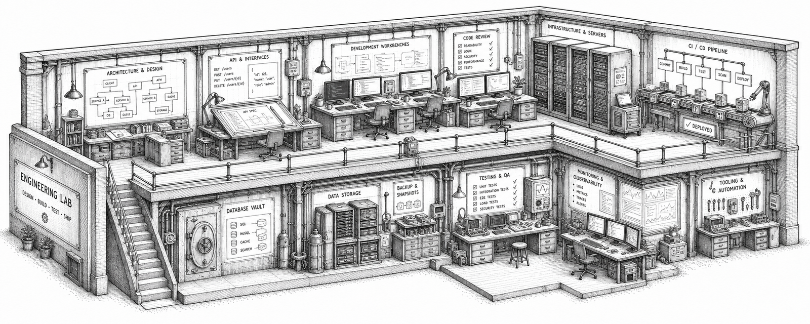

| Skill | Name |
| --- | --- |
| [`$engineering-ai-data-remediation-engineer`](skills/engineering/engineering-ai-data-remediation-engineer/SKILL.md) | AI Data Remediation Engineer |
| [`$engineering-ai-engineer`](skills/engineering/engineering-ai-engineer/SKILL.md) | AI Engineer |
| [`$engineering-autonomous-optimization-architect`](skills/engineering/engineering-autonomous-optimization-architect/SKILL.md) | Autonomous Optimization Architect |
| [`$engineering-backend-architect`](skills/engineering/engineering-backend-architect/SKILL.md) | Backend Architect |
| [`$engineering-cms-developer`](skills/engineering/engineering-cms-developer/SKILL.md) | CMS Developer |
| [`$engineering-code-reviewer`](skills/engineering/engineering-code-reviewer/SKILL.md) | Code Reviewer |
| [`$engineering-codebase-onboarding-engineer`](skills/engineering/engineering-codebase-onboarding-engineer/SKILL.md) | Codebase Onboarding Engineer |
| [`$engineering-data-engineer`](skills/engineering/engineering-data-engineer/SKILL.md) | Data Engineer |
| [`$engineering-database-optimizer`](skills/engineering/engineering-database-optimizer/SKILL.md) | Database Optimizer |
| [`$engineering-devops-automator`](skills/engineering/engineering-devops-automator/SKILL.md) | DevOps Automator |
| [`$engineering-drupal-shopping-cart`](skills/engineering/engineering-drupal-shopping-cart/SKILL.md) | Drupal Shopping Cart Engineer |
| [`$engineering-email-intelligence-engineer`](skills/engineering/engineering-email-intelligence-engineer/SKILL.md) | Email Intelligence Engineer |
| [`$engineering-embedded-firmware-engineer`](skills/engineering/engineering-embedded-firmware-engineer/SKILL.md) | Embedded Firmware Engineer |
| [`$engineering-feishu-integration-developer`](skills/engineering/engineering-feishu-integration-developer/SKILL.md) | Feishu Integration Developer |
| [`$engineering-filament-optimization-specialist`](skills/engineering/engineering-filament-optimization-specialist/SKILL.md) | Filament Optimization Specialist |
| [`$engineering-frontend-developer`](skills/engineering/engineering-frontend-developer/SKILL.md) | Frontend Developer |
| [`$engineering-git-workflow-master`](skills/engineering/engineering-git-workflow-master/SKILL.md) | Git Workflow Master |
| [`$engineering-it-service-manager`](skills/engineering/engineering-it-service-manager/SKILL.md) | IT Service Manager |
| [`$engineering-incident-response-commander`](skills/engineering/engineering-incident-response-commander/SKILL.md) | Incident Response Commander |
| [`$engineering-minimal-change-engineer`](skills/engineering/engineering-minimal-change-engineer/SKILL.md) | Minimal Change Engineer |
| [`$engineering-mobile-app-builder`](skills/engineering/engineering-mobile-app-builder/SKILL.md) | Mobile App Builder |
| [`$engineering-multi-agent-systems-architect`](skills/engineering/engineering-multi-agent-systems-architect/SKILL.md) | Multi-Agent Systems Architect |
| [`$engineering-orgscript-engineer`](skills/engineering/engineering-orgscript-engineer/SKILL.md) | OrgScript Engineer |
| [`$engineering-prompt-engineer`](skills/engineering/engineering-prompt-engineer/SKILL.md) | Prompt Engineer |
| [`$engineering-rapid-prototyper`](skills/engineering/engineering-rapid-prototyper/SKILL.md) | Rapid Prototyper |
| [`$engineering-sre`](skills/engineering/engineering-sre/SKILL.md) | SRE \(Site Reliability Engineer\) |
| [`$engineering-senior-developer`](skills/engineering/engineering-senior-developer/SKILL.md) | Senior Developer |
| [`$engineering-software-architect`](skills/engineering/engineering-software-architect/SKILL.md) | Software Architect |
| [`$engineering-solidity-smart-contract-engineer`](skills/engineering/engineering-solidity-smart-contract-engineer/SKILL.md) | Solidity Smart Contract Engineer |
| [`$engineering-technical-writer`](skills/engineering/engineering-technical-writer/SKILL.md) | Technical Writer |
| [`$engineering-voice-ai-integration-engineer`](skills/engineering/engineering-voice-ai-integration-engineer/SKILL.md) | Voice AI Integration Engineer |
| [`$engineering-wechat-mini-program-developer`](skills/engineering/engineering-wechat-mini-program-developer/SKILL.md) | WeChat Mini Program Developer |
| [`$engineering-wordpress-shopping-cart`](skills/engineering/engineering-wordpress-shopping-cart/SKILL.md) | WordPress Shopping Cart Engineer |

### Finance (5)

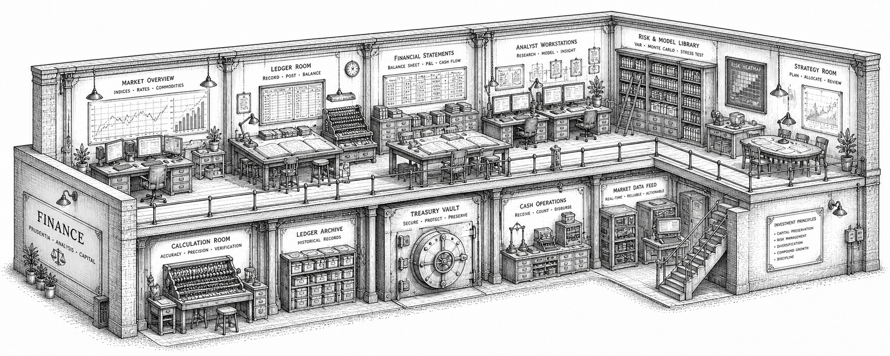

| Skill | Name |
| --- | --- |
| [`$finance-bookkeeper-controller`](skills/finance/finance-bookkeeper-controller/SKILL.md) | Bookkeeper & Controller |
| [`$finance-fpa-analyst`](skills/finance/finance-fpa-analyst/SKILL.md) | FP&A Analyst |
| [`$finance-financial-analyst`](skills/finance/finance-financial-analyst/SKILL.md) | Financial Analyst |
| [`$finance-investment-researcher`](skills/finance/finance-investment-researcher/SKILL.md) | Investment Researcher |
| [`$finance-tax-strategist`](skills/finance/finance-tax-strategist/SKILL.md) | Tax Strategist |

### Game Development (20)

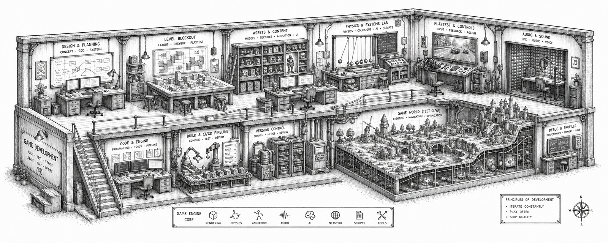

| Skill | Name |
| --- | --- |
| [`$blender-addon-engineer`](skills/game-development/blender-addon-engineer/SKILL.md) | Blender Add-on Engineer |
| [`$game-audio-engineer`](skills/game-development/game-audio-engineer/SKILL.md) | Game Audio Engineer |
| [`$game-designer`](skills/game-development/game-designer/SKILL.md) | Game Designer |
| [`$godot-gameplay-scripter`](skills/game-development/godot-gameplay-scripter/SKILL.md) | Godot Gameplay Scripter |
| [`$godot-multiplayer-engineer`](skills/game-development/godot-multiplayer-engineer/SKILL.md) | Godot Multiplayer Engineer |
| [`$godot-shader-developer`](skills/game-development/godot-shader-developer/SKILL.md) | Godot Shader Developer |
| [`$level-designer`](skills/game-development/level-designer/SKILL.md) | Level Designer |
| [`$narrative-designer`](skills/game-development/narrative-designer/SKILL.md) | Narrative Designer |
| [`$roblox-avatar-creator`](skills/game-development/roblox-avatar-creator/SKILL.md) | Roblox Avatar Creator |
| [`$roblox-experience-designer`](skills/game-development/roblox-experience-designer/SKILL.md) | Roblox Experience Designer |
| [`$roblox-systems-scripter`](skills/game-development/roblox-systems-scripter/SKILL.md) | Roblox Systems Scripter |
| [`$technical-artist`](skills/game-development/technical-artist/SKILL.md) | Technical Artist |
| [`$unity-architect`](skills/game-development/unity-architect/SKILL.md) | Unity Architect |
| [`$unity-editor-tool-developer`](skills/game-development/unity-editor-tool-developer/SKILL.md) | Unity Editor Tool Developer |
| [`$unity-multiplayer-engineer`](skills/game-development/unity-multiplayer-engineer/SKILL.md) | Unity Multiplayer Engineer |
| [`$unity-shader-graph-artist`](skills/game-development/unity-shader-graph-artist/SKILL.md) | Unity Shader Graph Artist |
| [`$unreal-multiplayer-architect`](skills/game-development/unreal-multiplayer-architect/SKILL.md) | Unreal Multiplayer Architect |
| [`$unreal-systems-engineer`](skills/game-development/unreal-systems-engineer/SKILL.md) | Unreal Systems Engineer |
| [`$unreal-technical-artist`](skills/game-development/unreal-technical-artist/SKILL.md) | Unreal Technical Artist |
| [`$unreal-world-builder`](skills/game-development/unreal-world-builder/SKILL.md) | Unreal World Builder |

### Gis (13)

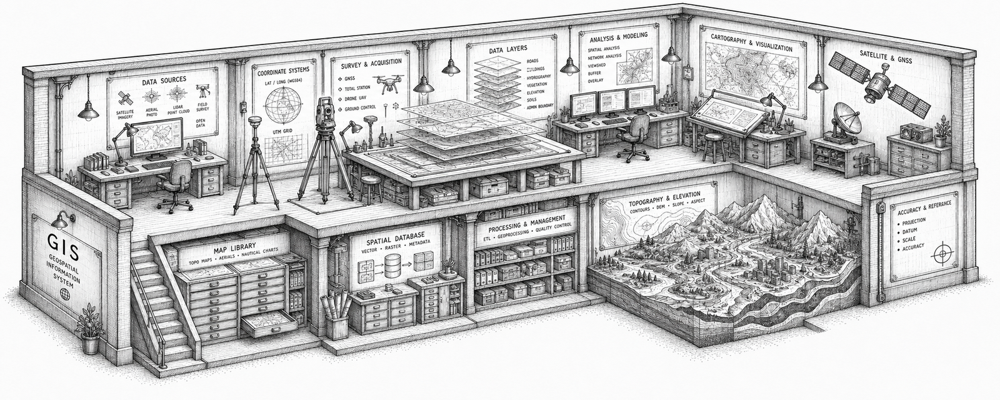

| Skill | Name |
| --- | --- |
| [`$gis-3d-scene-developer`](skills/gis/gis-3d-scene-developer/SKILL.md) | 3D & Scene Developer |
| [`$gis-bim-specialist`](skills/gis/gis-bim-specialist/SKILL.md) | BIM/GIS Specialist |
| [`$gis-cartography-designer`](skills/gis/gis-cartography-designer/SKILL.md) | Cartography Designer |
| [`$gis-drone-reality-mapping`](skills/gis/gis-drone-reality-mapping/SKILL.md) | Drone/Reality Mapping Specialist |
| [`$gis-analyst`](skills/gis/gis-analyst/SKILL.md) | GIS Analyst |
| [`$gis-qa-engineer`](skills/gis/gis-qa-engineer/SKILL.md) | GIS QA Engineer |
| [`$gis-geoai-ml-engineer`](skills/gis/gis-geoai-ml-engineer/SKILL.md) | GeoAI/ML Engineer |
| [`$gis-geoprocessing-specialist`](skills/gis/gis-geoprocessing-specialist/SKILL.md) | Geoprocessing Specialist |
| [`$gis-solution-engineer`](skills/gis/gis-solution-engineer/SKILL.md) | Solution Engineer |
| [`$gis-spatial-data-engineer`](skills/gis/gis-spatial-data-engineer/SKILL.md) | Spatial Data Engineer |
| [`$gis-spatial-data-scientist`](skills/gis/gis-spatial-data-scientist/SKILL.md) | Spatial Data Scientist |
| [`$gis-technical-consultant`](skills/gis/gis-technical-consultant/SKILL.md) | Technical Consultant |
| [`$gis-web-gis-developer`](skills/gis/gis-web-gis-developer/SKILL.md) | Web GIS Developer |

### Marketing (36)

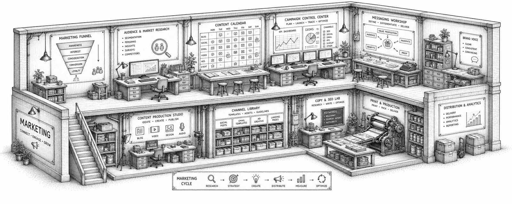

| Skill | Name |
| --- | --- |
| [`$marketing-aeo-foundations`](skills/marketing/marketing-aeo-foundations/SKILL.md) | AEO Foundations Architect |
| [`$marketing-ai-citation-strategist`](skills/marketing/marketing-ai-citation-strategist/SKILL.md) | AI Citation Strategist |
| [`$marketing-agentic-search-optimizer`](skills/marketing/marketing-agentic-search-optimizer/SKILL.md) | Agentic Search Optimizer |
| [`$marketing-app-store-optimizer`](skills/marketing/marketing-app-store-optimizer/SKILL.md) | App Store Optimizer |
| [`$marketing-baidu-seo-specialist`](skills/marketing/marketing-baidu-seo-specialist/SKILL.md) | Baidu SEO Specialist |
| [`$marketing-bilibili-content-strategist`](skills/marketing/marketing-bilibili-content-strategist/SKILL.md) | Bilibili Content Strategist |
| [`$marketing-book-co-author`](skills/marketing/marketing-book-co-author/SKILL.md) | Book Co-Author |
| [`$marketing-carousel-growth-engine`](skills/marketing/marketing-carousel-growth-engine/SKILL.md) | Carousel Growth Engine |
| [`$marketing-china-ecommerce-operator`](skills/marketing/marketing-china-ecommerce-operator/SKILL.md) | China E-Commerce Operator |
| [`$marketing-china-market-localization-strategist`](skills/marketing/marketing-china-market-localization-strategist/SKILL.md) | China Market Localization Strategist |
| [`$marketing-content-creator`](skills/marketing/marketing-content-creator/SKILL.md) | Content Creator |
| [`$marketing-cross-border-ecommerce`](skills/marketing/marketing-cross-border-ecommerce/SKILL.md) | Cross-Border E-Commerce Specialist |
| [`$marketing-douyin-strategist`](skills/marketing/marketing-douyin-strategist/SKILL.md) | Douyin Strategist |
| [`$marketing-email-strategist`](skills/marketing/marketing-email-strategist/SKILL.md) | Email Marketing Strategist |
| [`$marketing-global-podcast-strategist`](skills/marketing/marketing-global-podcast-strategist/SKILL.md) | Global Podcast Strategist |
| [`$marketing-growth-hacker`](skills/marketing/marketing-growth-hacker/SKILL.md) | Growth Hacker |
| [`$marketing-instagram-curator`](skills/marketing/marketing-instagram-curator/SKILL.md) | Instagram Curator |
| [`$marketing-kuaishou-strategist`](skills/marketing/marketing-kuaishou-strategist/SKILL.md) | Kuaishou Strategist |
| [`$marketing-linkedin-content-creator`](skills/marketing/marketing-linkedin-content-creator/SKILL.md) | LinkedIn Content Creator |
| [`$marketing-livestream-commerce-coach`](skills/marketing/marketing-livestream-commerce-coach/SKILL.md) | Livestream Commerce Coach |
| [`$marketing-multi-platform-publisher`](skills/marketing/marketing-multi-platform-publisher/SKILL.md) | Multi-Platform Publisher |
| [`$marketing-pr-communications-manager`](skills/marketing/marketing-pr-communications-manager/SKILL.md) | PR & Communications Manager |
| [`$marketing-podcast-strategist`](skills/marketing/marketing-podcast-strategist/SKILL.md) | Podcast Strategist |
| [`$marketing-private-domain-operator`](skills/marketing/marketing-private-domain-operator/SKILL.md) | Private Domain Operator |
| [`$marketing-reddit-community-builder`](skills/marketing/marketing-reddit-community-builder/SKILL.md) | Reddit Community Builder |
| [`$marketing-seo-specialist`](skills/marketing/marketing-seo-specialist/SKILL.md) | SEO Specialist |
| [`$marketing-short-video-editing-coach`](skills/marketing/marketing-short-video-editing-coach/SKILL.md) | Short-Video Editing Coach |
| [`$marketing-social-media-strategist`](skills/marketing/marketing-social-media-strategist/SKILL.md) | Social Media Strategist |
| [`$marketing-tiktok-strategist`](skills/marketing/marketing-tiktok-strategist/SKILL.md) | TikTok Strategist |
| [`$marketing-twitter-engager`](skills/marketing/marketing-twitter-engager/SKILL.md) | Twitter Engager |
| [`$marketing-video-optimization-specialist`](skills/marketing/marketing-video-optimization-specialist/SKILL.md) | Video Optimization Specialist |
| [`$marketing-wechat-official-account`](skills/marketing/marketing-wechat-official-account/SKILL.md) | WeChat Official Account Manager |
| [`$marketing-weibo-strategist`](skills/marketing/marketing-weibo-strategist/SKILL.md) | Weibo Strategist |
| [`$marketing-x-twitter-intelligence-analyst`](skills/marketing/marketing-x-twitter-intelligence-analyst/SKILL.md) | X/Twitter Intelligence Analyst |
| [`$marketing-xiaohongshu-specialist`](skills/marketing/marketing-xiaohongshu-specialist/SKILL.md) | Xiaohongshu Specialist |
| [`$marketing-zhihu-strategist`](skills/marketing/marketing-zhihu-strategist/SKILL.md) | Zhihu Strategist |

### Marketing Skills (45)

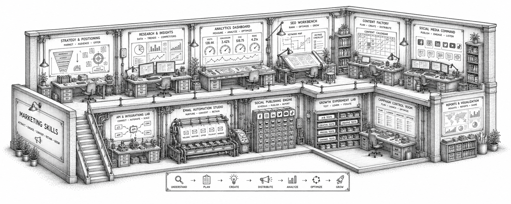

| Skill | Name |
| --- | --- |
| [`$ab-testing`](skills/marketing-skills/ab-testing/SKILL.md) | Ab Testing |
| [`$ad-creative`](skills/marketing-skills/ad-creative/SKILL.md) | Ad Creative |
| [`$ads`](skills/marketing-skills/ads/SKILL.md) | Ads |
| [`$ai-seo`](skills/marketing-skills/ai-seo/SKILL.md) | Ai Seo |
| [`$analytics`](skills/marketing-skills/analytics/SKILL.md) | Analytics |
| [`$aso`](skills/marketing-skills/aso/SKILL.md) | Aso |
| [`$churn-prevention`](skills/marketing-skills/churn-prevention/SKILL.md) | Churn Prevention |
| [`$co-marketing`](skills/marketing-skills/co-marketing/SKILL.md) | Co Marketing |
| [`$cold-email`](skills/marketing-skills/cold-email/SKILL.md) | Cold Email |
| [`$community-marketing`](skills/marketing-skills/community-marketing/SKILL.md) | Community Marketing |
| [`$competitor-profiling`](skills/marketing-skills/competitor-profiling/SKILL.md) | Competitor Profiling |
| [`$competitors`](skills/marketing-skills/competitors/SKILL.md) | Competitors |
| [`$content-strategy`](skills/marketing-skills/content-strategy/SKILL.md) | Content Strategy |
| [`$copy-editing`](skills/marketing-skills/copy-editing/SKILL.md) | Copy Editing |
| [`$copywriting`](skills/marketing-skills/copywriting/SKILL.md) | Copywriting |
| [`$cro`](skills/marketing-skills/cro/SKILL.md) | Cro |
| [`$customer-research`](skills/marketing-skills/customer-research/SKILL.md) | Customer Research |
| [`$directory-submissions`](skills/marketing-skills/directory-submissions/SKILL.md) | Directory Submissions |
| [`$emails`](skills/marketing-skills/emails/SKILL.md) | Emails |
| [`$free-tools`](skills/marketing-skills/free-tools/SKILL.md) | Free Tools |
| [`$image`](skills/marketing-skills/image/SKILL.md) | Image |
| [`$launch`](skills/marketing-skills/launch/SKILL.md) | Launch |
| [`$lead-magnets`](skills/marketing-skills/lead-magnets/SKILL.md) | Lead Magnets |
| [`$marketing-ideas`](skills/marketing-skills/marketing-ideas/SKILL.md) | Marketing Ideas |
| [`$marketing-plan`](skills/marketing-skills/marketing-plan/SKILL.md) | Marketing Plan |
| [`$marketing-psychology`](skills/marketing-skills/marketing-psychology/SKILL.md) | Marketing Psychology |
| [`$offers`](skills/marketing-skills/offers/SKILL.md) | Offers |
| [`$onboarding`](skills/marketing-skills/onboarding/SKILL.md) | Onboarding |
| [`$paywalls`](skills/marketing-skills/paywalls/SKILL.md) | Paywalls |
| [`$popups`](skills/marketing-skills/popups/SKILL.md) | Popups |
| [`$pricing`](skills/marketing-skills/pricing/SKILL.md) | Pricing |
| [`$product-marketing`](skills/marketing-skills/product-marketing/SKILL.md) | Product Marketing |
| [`$programmatic-seo`](skills/marketing-skills/programmatic-seo/SKILL.md) | Programmatic Seo |
| [`$prospecting`](skills/marketing-skills/prospecting/SKILL.md) | Prospecting |
| [`$public-relations`](skills/marketing-skills/public-relations/SKILL.md) | Public Relations |
| [`$referrals`](skills/marketing-skills/referrals/SKILL.md) | Referrals |
| [`$revops`](skills/marketing-skills/revops/SKILL.md) | Revops |
| [`$sales-enablement`](skills/marketing-skills/sales-enablement/SKILL.md) | Sales Enablement |
| [`$schema`](skills/marketing-skills/schema/SKILL.md) | Schema |
| [`$seo-audit`](skills/marketing-skills/seo-audit/SKILL.md) | Seo Audit |
| [`$signup`](skills/marketing-skills/signup/SKILL.md) | Signup |
| [`$site-architecture`](skills/marketing-skills/site-architecture/SKILL.md) | Site Architecture |
| [`$sms`](skills/marketing-skills/sms/SKILL.md) | Sms |
| [`$social`](skills/marketing-skills/social/SKILL.md) | Social |
| [`$video`](skills/marketing-skills/video/SKILL.md) | Video |

### Paid Media (7)


| Skill | Name |
| --- | --- |
| [`$paid-media-creative-strategist`](skills/paid-media/paid-media-creative-strategist/SKILL.md) | Ad Creative Strategist |
| [`$paid-media-ppc-strategist`](skills/paid-media/paid-media-ppc-strategist/SKILL.md) | PPC Campaign Strategist |
| [`$paid-media-auditor`](skills/paid-media/paid-media-auditor/SKILL.md) | Paid Media Auditor |
| [`$paid-media-paid-social-strategist`](skills/paid-media/paid-media-paid-social-strategist/SKILL.md) | Paid Social Strategist |
| [`$paid-media-programmatic-buyer`](skills/paid-media/paid-media-programmatic-buyer/SKILL.md) | Programmatic & Display Buyer |
| [`$paid-media-search-query-analyst`](skills/paid-media/paid-media-search-query-analyst/SKILL.md) | Search Query Analyst |
| [`$paid-media-tracking-specialist`](skills/paid-media/paid-media-tracking-specialist/SKILL.md) | Tracking & Measurement Specialist |

### PM Skills (68)

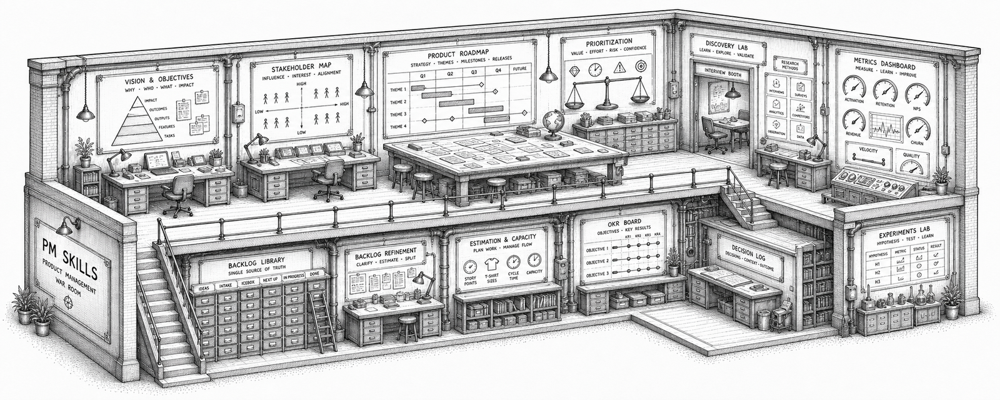

| Skill | Name |
| --- | --- |
| [`$ab-test-analysis`](skills/pm-skills/ab-test-analysis/SKILL.md) | Ab Test Analysis |
| [`$analyze-feature-requests`](skills/pm-skills/analyze-feature-requests/SKILL.md) | Analyze Feature Requests |
| [`$ansoff-matrix`](skills/pm-skills/ansoff-matrix/SKILL.md) | Ansoff Matrix |
| [`$beachhead-segment`](skills/pm-skills/beachhead-segment/SKILL.md) | Beachhead Segment |
| [`$brainstorm-experiments-existing`](skills/pm-skills/brainstorm-experiments-existing/SKILL.md) | Brainstorm Experiments Existing |
| [`$brainstorm-experiments-new`](skills/pm-skills/brainstorm-experiments-new/SKILL.md) | Brainstorm Experiments New |
| [`$brainstorm-ideas-existing`](skills/pm-skills/brainstorm-ideas-existing/SKILL.md) | Brainstorm Ideas Existing |
| [`$brainstorm-ideas-new`](skills/pm-skills/brainstorm-ideas-new/SKILL.md) | Brainstorm Ideas New |
| [`$brainstorm-okrs`](skills/pm-skills/brainstorm-okrs/SKILL.md) | Brainstorm Okrs |
| [`$business-model`](skills/pm-skills/business-model/SKILL.md) | Business Model |
| [`$cohort-analysis`](skills/pm-skills/cohort-analysis/SKILL.md) | Cohort Analysis |
| [`$competitive-battlecard`](skills/pm-skills/competitive-battlecard/SKILL.md) | Competitive Battlecard |
| [`$competitor-analysis`](skills/pm-skills/competitor-analysis/SKILL.md) | Competitor Analysis |
| [`$create-prd`](skills/pm-skills/create-prd/SKILL.md) | Create Prd |
| [`$customer-journey-map`](skills/pm-skills/customer-journey-map/SKILL.md) | Customer Journey Map |
| [`$draft-nda`](skills/pm-skills/draft-nda/SKILL.md) | Draft Nda |
| [`$dummy-dataset`](skills/pm-skills/dummy-dataset/SKILL.md) | Dummy Dataset |
| [`$grammar-check`](skills/pm-skills/grammar-check/SKILL.md) | Grammar Check |
| [`$growth-loops`](skills/pm-skills/growth-loops/SKILL.md) | Growth Loops |
| [`$gtm-motions`](skills/pm-skills/gtm-motions/SKILL.md) | Gtm Motions |
| [`$gtm-strategy`](skills/pm-skills/gtm-strategy/SKILL.md) | Gtm Strategy |
| [`$ideal-customer-profile`](skills/pm-skills/ideal-customer-profile/SKILL.md) | Ideal Customer Profile |
| [`$identify-assumptions-existing`](skills/pm-skills/identify-assumptions-existing/SKILL.md) | Identify Assumptions Existing |
| [`$identify-assumptions-new`](skills/pm-skills/identify-assumptions-new/SKILL.md) | Identify Assumptions New |
| [`$intended-vs-implemented`](skills/pm-skills/intended-vs-implemented/SKILL.md) | Intended Vs Implemented |
| [`$interview-script`](skills/pm-skills/interview-script/SKILL.md) | Interview Script |
| [`$job-stories`](skills/pm-skills/job-stories/SKILL.md) | Job Stories |
| [`$lean-canvas`](skills/pm-skills/lean-canvas/SKILL.md) | Lean Canvas |
| [`$market-segments`](skills/pm-skills/market-segments/SKILL.md) | Market Segments |
| [`$market-sizing`](skills/pm-skills/market-sizing/SKILL.md) | Market Sizing |
| [`$pm-skills-pm-marketing-growth-marketing-ideas-marketing-ideas`](skills/pm-skills/pm-skills-pm-marketing-growth-marketing-ideas-marketing-ideas/SKILL.md) | Marketing Ideas |
| [`$metrics-dashboard`](skills/pm-skills/metrics-dashboard/SKILL.md) | Metrics Dashboard |
| [`$monetization-strategy`](skills/pm-skills/monetization-strategy/SKILL.md) | Monetization Strategy |
| [`$north-star-metric`](skills/pm-skills/north-star-metric/SKILL.md) | North Star Metric |
| [`$opportunity-solution-tree`](skills/pm-skills/opportunity-solution-tree/SKILL.md) | Opportunity Solution Tree |
| [`$outcome-roadmap`](skills/pm-skills/outcome-roadmap/SKILL.md) | Outcome Roadmap |
| [`$pestle-analysis`](skills/pm-skills/pestle-analysis/SKILL.md) | Pestle Analysis |
| [`$porters-five-forces`](skills/pm-skills/porters-five-forces/SKILL.md) | Porters Five Forces |
| [`$positioning-ideas`](skills/pm-skills/positioning-ideas/SKILL.md) | Positioning Ideas |
| [`$pre-mortem`](skills/pm-skills/pre-mortem/SKILL.md) | Pre Mortem |
| [`$pricing-strategy`](skills/pm-skills/pricing-strategy/SKILL.md) | Pricing Strategy |
| [`$prioritization-frameworks`](skills/pm-skills/prioritization-frameworks/SKILL.md) | Prioritization Frameworks |
| [`$prioritize-assumptions`](skills/pm-skills/prioritize-assumptions/SKILL.md) | Prioritize Assumptions |
| [`$prioritize-features`](skills/pm-skills/prioritize-features/SKILL.md) | Prioritize Features |
| [`$privacy-policy`](skills/pm-skills/privacy-policy/SKILL.md) | Privacy Policy |
| [`$product-name`](skills/pm-skills/product-name/SKILL.md) | Product Name |
| [`$product-strategy`](skills/pm-skills/product-strategy/SKILL.md) | Product Strategy |
| [`$product-vision`](skills/pm-skills/product-vision/SKILL.md) | Product Vision |
| [`$release-notes`](skills/pm-skills/release-notes/SKILL.md) | Release Notes |
| [`$retro`](skills/pm-skills/retro/SKILL.md) | Retro |
| [`$review-resume`](skills/pm-skills/review-resume/SKILL.md) | Review Resume |
| [`$sentiment-analysis`](skills/pm-skills/sentiment-analysis/SKILL.md) | Sentiment Analysis |
| [`$shipping-artifacts`](skills/pm-skills/shipping-artifacts/SKILL.md) | Shipping Artifacts |
| [`$sprint-plan`](skills/pm-skills/sprint-plan/SKILL.md) | Sprint Plan |
| [`$sql-queries`](skills/pm-skills/sql-queries/SKILL.md) | Sql Queries |
| [`$stakeholder-map`](skills/pm-skills/stakeholder-map/SKILL.md) | Stakeholder Map |
| [`$startup-canvas`](skills/pm-skills/startup-canvas/SKILL.md) | Startup Canvas |
| [`$strategy-red-team`](skills/pm-skills/strategy-red-team/SKILL.md) | Strategy Red Team |
| [`$summarize-interview`](skills/pm-skills/summarize-interview/SKILL.md) | Summarize Interview |
| [`$summarize-meeting`](skills/pm-skills/summarize-meeting/SKILL.md) | Summarize Meeting |
| [`$swot-analysis`](skills/pm-skills/swot-analysis/SKILL.md) | Swot Analysis |
| [`$test-scenarios`](skills/pm-skills/test-scenarios/SKILL.md) | Test Scenarios |
| [`$user-personas`](skills/pm-skills/user-personas/SKILL.md) | User Personas |
| [`$user-segmentation`](skills/pm-skills/user-segmentation/SKILL.md) | User Segmentation |
| [`$user-stories`](skills/pm-skills/user-stories/SKILL.md) | User Stories |
| [`$value-prop-statements`](skills/pm-skills/value-prop-statements/SKILL.md) | Value Prop Statements |
| [`$value-proposition`](skills/pm-skills/value-proposition/SKILL.md) | Value Proposition |
| [`$wwas`](skills/pm-skills/wwas/SKILL.md) | Wwas |

### Product (5)

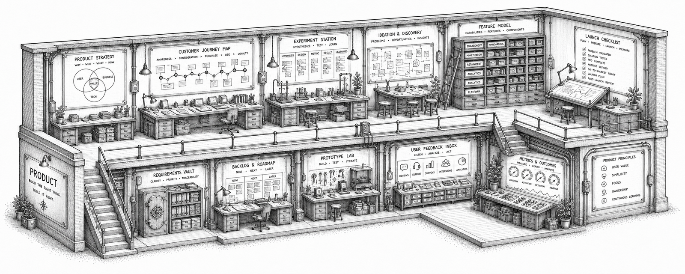

| Skill | Name |
| --- | --- |
| [`$product-behavioral-nudge-engine`](skills/product/product-behavioral-nudge-engine/SKILL.md) | Behavioral Nudge Engine |
| [`$product-feedback-synthesizer`](skills/product/product-feedback-synthesizer/SKILL.md) | Feedback Synthesizer |
| [`$product-manager`](skills/product/product-manager/SKILL.md) | Product Manager |
| [`$product-sprint-prioritizer`](skills/product/product-sprint-prioritizer/SKILL.md) | Sprint Prioritizer |
| [`$product-trend-researcher`](skills/product/product-trend-researcher/SKILL.md) | Trend Researcher |

### Project Management (7)

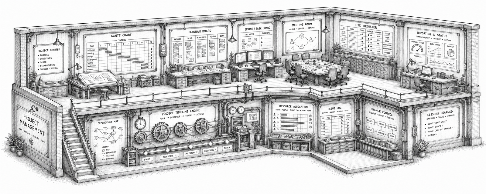

| Skill | Name |
| --- | --- |
| [`$project-management-experiment-tracker`](skills/project-management/project-management-experiment-tracker/SKILL.md) | Experiment Tracker |
| [`$project-management-jira-workflow-steward`](skills/project-management/project-management-jira-workflow-steward/SKILL.md) | Jira Workflow Steward |
| [`$project-management-meeting-notes-specialist`](skills/project-management/project-management-meeting-notes-specialist/SKILL.md) | Meeting Notes Specialist |
| [`$project-management-project-shepherd`](skills/project-management/project-management-project-shepherd/SKILL.md) | Project Shepherd |
| [`$project-manager-senior`](skills/project-management/project-manager-senior/SKILL.md) | Senior Project Manager |
| [`$project-management-studio-operations`](skills/project-management/project-management-studio-operations/SKILL.md) | Studio Operations |
| [`$project-management-studio-producer`](skills/project-management/project-management-studio-producer/SKILL.md) | Studio Producer |

### Sales (9)

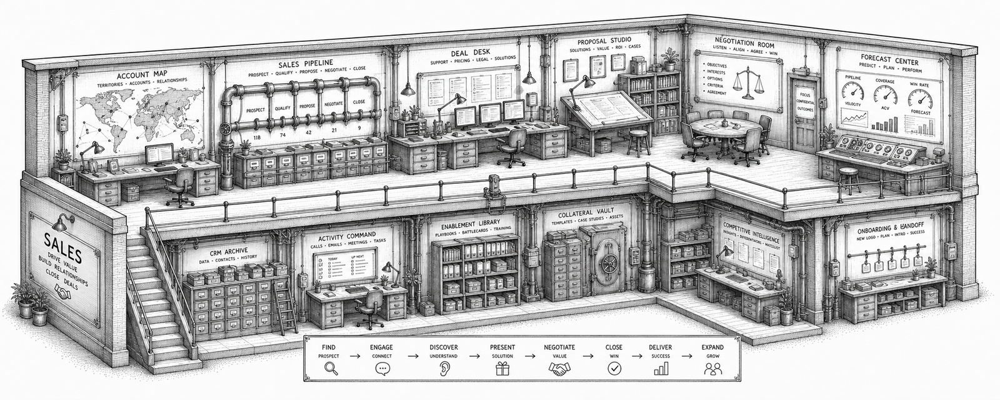

| Skill | Name |
| --- | --- |
| [`$sales-account-strategist`](skills/sales/sales-account-strategist/SKILL.md) | Account Strategist |
| [`$sales-deal-strategist`](skills/sales/sales-deal-strategist/SKILL.md) | Deal Strategist |
| [`$sales-discovery-coach`](skills/sales/sales-discovery-coach/SKILL.md) | Discovery Coach |
| [`$sales-offer-lead-gen-strategist`](skills/sales/sales-offer-lead-gen-strategist/SKILL.md) | Offer & Lead Gen Strategist |
| [`$sales-outbound-strategist`](skills/sales/sales-outbound-strategist/SKILL.md) | Outbound Strategist |
| [`$sales-pipeline-analyst`](skills/sales/sales-pipeline-analyst/SKILL.md) | Pipeline Analyst |
| [`$sales-proposal-strategist`](skills/sales/sales-proposal-strategist/SKILL.md) | Proposal Strategist |
| [`$sales-coach`](skills/sales/sales-coach/SKILL.md) | Sales Coach |
| [`$sales-engineer`](skills/sales/sales-engineer/SKILL.md) | Sales Engineer |

### Scientific Agent Skills (149)

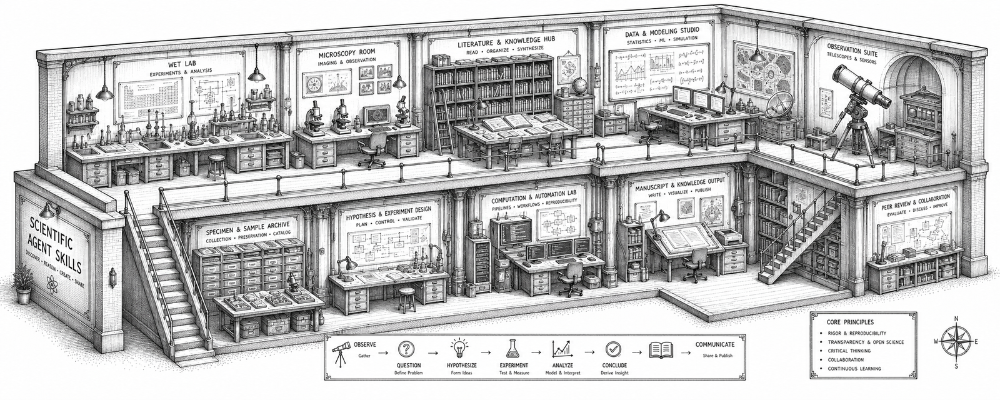

| Skill | Name |
| --- | --- |
| [`$adaptyv`](skills/scientific-agent-skills/adaptyv/SKILL.md) | Adaptyv |
| [`$aeon`](skills/scientific-agent-skills/aeon/SKILL.md) | Aeon |
| [`$anndata`](skills/scientific-agent-skills/anndata/SKILL.md) | Anndata |
| [`$arbor`](skills/scientific-agent-skills/arbor/SKILL.md) | Arbor |
| [`$arboreto`](skills/scientific-agent-skills/arboreto/SKILL.md) | Arboreto |
| [`$astropy`](skills/scientific-agent-skills/astropy/SKILL.md) | Astropy |
| [`$autoskill`](skills/scientific-agent-skills/autoskill/SKILL.md) | Autoskill |
| [`$benchling-integration`](skills/scientific-agent-skills/benchling-integration/SKILL.md) | Benchling Integration |
| [`$bgpt-paper-search`](skills/scientific-agent-skills/bgpt-paper-search/SKILL.md) | Bgpt Paper Search |
| [`$bids`](skills/scientific-agent-skills/bids/SKILL.md) | Bids |
| [`$biopython`](skills/scientific-agent-skills/biopython/SKILL.md) | Biopython |
| [`$bioservices`](skills/scientific-agent-skills/bioservices/SKILL.md) | Bioservices |
| [`$bulk-rnaseq`](skills/scientific-agent-skills/bulk-rnaseq/SKILL.md) | Bulk Rnaseq |
| [`$cellxgene-census`](skills/scientific-agent-skills/cellxgene-census/SKILL.md) | Cellxgene Census |
| [`$cirq`](skills/scientific-agent-skills/cirq/SKILL.md) | Cirq |
| [`$citation-management`](skills/scientific-agent-skills/citation-management/SKILL.md) | Citation Management |
| [`$clinical-decision-support`](skills/scientific-agent-skills/clinical-decision-support/SKILL.md) | Clinical Decision Support |
| [`$clinical-reports`](skills/scientific-agent-skills/clinical-reports/SKILL.md) | Clinical Reports |
| [`$cobrapy`](skills/scientific-agent-skills/cobrapy/SKILL.md) | Cobrapy |
| [`$consciousness-council`](skills/scientific-agent-skills/consciousness-council/SKILL.md) | Consciousness Council |
| [`$dask`](skills/scientific-agent-skills/dask/SKILL.md) | Dask |
| [`$database-lookup`](skills/scientific-agent-skills/database-lookup/SKILL.md) | Database Lookup |
| [`$datamol`](skills/scientific-agent-skills/datamol/SKILL.md) | Datamol |
| [`$deepchem`](skills/scientific-agent-skills/deepchem/SKILL.md) | Deepchem |
| [`$deeptools`](skills/scientific-agent-skills/deeptools/SKILL.md) | Deeptools |
| [`$depmap`](skills/scientific-agent-skills/depmap/SKILL.md) | Depmap |
| [`$dhdna-profiler`](skills/scientific-agent-skills/dhdna-profiler/SKILL.md) | Dhdna Profiler |
| [`$diffdock`](skills/scientific-agent-skills/diffdock/SKILL.md) | Diffdock |
| [`$dnanexus-integration`](skills/scientific-agent-skills/dnanexus-integration/SKILL.md) | Dnanexus Integration |
| [`$docx`](skills/scientific-agent-skills/docx/SKILL.md) | Docx |
| [`$esm`](skills/scientific-agent-skills/esm/SKILL.md) | Esm |
| [`$etetoolkit`](skills/scientific-agent-skills/etetoolkit/SKILL.md) | Etetoolkit |
| [`$exa-search`](skills/scientific-agent-skills/exa-search/SKILL.md) | Exa Search |
| [`$experimental-design`](skills/scientific-agent-skills/experimental-design/SKILL.md) | Experimental Design |
| [`$exploratory-data-analysis`](skills/scientific-agent-skills/exploratory-data-analysis/SKILL.md) | Exploratory Data Analysis |
| [`$flowio`](skills/scientific-agent-skills/flowio/SKILL.md) | Flowio |
| [`$fluidsim`](skills/scientific-agent-skills/fluidsim/SKILL.md) | Fluidsim |
| [`$generate-image`](skills/scientific-agent-skills/generate-image/SKILL.md) | Generate Image |
| [`$geniml`](skills/scientific-agent-skills/geniml/SKILL.md) | Geniml |
| [`$geomaster`](skills/scientific-agent-skills/geomaster/SKILL.md) | Geomaster |
| [`$geopandas`](skills/scientific-agent-skills/geopandas/SKILL.md) | Geopandas |
| [`$get-available-resources`](skills/scientific-agent-skills/get-available-resources/SKILL.md) | Get Available Resources |
| [`$gget`](skills/scientific-agent-skills/gget/SKILL.md) | Gget |
| [`$ginkgo-cloud-lab`](skills/scientific-agent-skills/ginkgo-cloud-lab/SKILL.md) | Ginkgo Cloud Lab |
| [`$glycoengineering`](skills/scientific-agent-skills/glycoengineering/SKILL.md) | Glycoengineering |
| [`$gtars`](skills/scientific-agent-skills/gtars/SKILL.md) | Gtars |
| [`$histolab`](skills/scientific-agent-skills/histolab/SKILL.md) | Histolab |
| [`$hugging-science`](skills/scientific-agent-skills/hugging-science/SKILL.md) | Hugging Science |
| [`$hypogenic`](skills/scientific-agent-skills/hypogenic/SKILL.md) | Hypogenic |
| [`$hypothesis-generation`](skills/scientific-agent-skills/hypothesis-generation/SKILL.md) | Hypothesis Generation |
| [`$imaging-data-commons`](skills/scientific-agent-skills/imaging-data-commons/SKILL.md) | Imaging Data Commons |
| [`$infographics`](skills/scientific-agent-skills/infographics/SKILL.md) | Infographics |
| [`$iso-13485-certification`](skills/scientific-agent-skills/iso-13485-certification/SKILL.md) | Iso 13485 Certification |
| [`$labarchive-integration`](skills/scientific-agent-skills/labarchive-integration/SKILL.md) | Labarchive Integration |
| [`$lamindb`](skills/scientific-agent-skills/lamindb/SKILL.md) | Lamindb |
| [`$latchbio-integration`](skills/scientific-agent-skills/latchbio-integration/SKILL.md) | Latchbio Integration |
| [`$latex-posters`](skills/scientific-agent-skills/latex-posters/SKILL.md) | Latex Posters |
| [`$liteparse`](skills/scientific-agent-skills/liteparse/SKILL.md) | Liteparse |
| [`$literature-review`](skills/scientific-agent-skills/literature-review/SKILL.md) | Literature Review |
| [`$markdown-mermaid-writing`](skills/scientific-agent-skills/markdown-mermaid-writing/SKILL.md) | Markdown Mermaid Writing |
| [`$market-research-reports`](skills/scientific-agent-skills/market-research-reports/SKILL.md) | Market Research Reports |
| [`$markitdown`](skills/scientific-agent-skills/markitdown/SKILL.md) | Markitdown |
| [`$matchms`](skills/scientific-agent-skills/matchms/SKILL.md) | Matchms |
| [`$matlab`](skills/scientific-agent-skills/matlab/SKILL.md) | Matlab |
| [`$matplotlib`](skills/scientific-agent-skills/matplotlib/SKILL.md) | Matplotlib |
| [`$medchem`](skills/scientific-agent-skills/medchem/SKILL.md) | Medchem |
| [`$modal`](skills/scientific-agent-skills/modal/SKILL.md) | Modal |
| [`$molecular-dynamics`](skills/scientific-agent-skills/molecular-dynamics/SKILL.md) | Molecular Dynamics |
| [`$molfeat`](skills/scientific-agent-skills/molfeat/SKILL.md) | Molfeat |
| [`$networkx`](skills/scientific-agent-skills/networkx/SKILL.md) | Networkx |
| [`$neurokit2`](skills/scientific-agent-skills/neurokit2/SKILL.md) | Neurokit2 |
| [`$neuropixels-analysis`](skills/scientific-agent-skills/neuropixels-analysis/SKILL.md) | Neuropixels Analysis |
| [`$nextflow`](skills/scientific-agent-skills/nextflow/SKILL.md) | Nextflow |
| [`$omero-integration`](skills/scientific-agent-skills/omero-integration/SKILL.md) | Omero Integration |
| [`$onekgpd`](skills/scientific-agent-skills/onekgpd/SKILL.md) | Onekgpd |
| [`$open-notebook`](skills/scientific-agent-skills/open-notebook/SKILL.md) | Open Notebook |
| [`$opentrons-integration`](skills/scientific-agent-skills/opentrons-integration/SKILL.md) | Opentrons Integration |
| [`$optimize-for-gpu`](skills/scientific-agent-skills/optimize-for-gpu/SKILL.md) | Optimize For Gpu |
| [`$pacsomatic`](skills/scientific-agent-skills/pacsomatic/SKILL.md) | Pacsomatic |
| [`$paper-lookup`](skills/scientific-agent-skills/paper-lookup/SKILL.md) | Paper Lookup |
| [`$paperzilla`](skills/scientific-agent-skills/paperzilla/SKILL.md) | Paperzilla |
| [`$parallel-web`](skills/scientific-agent-skills/parallel-web/SKILL.md) | Parallel Web |
| [`$pathml`](skills/scientific-agent-skills/pathml/SKILL.md) | Pathml |
| [`$pathway-enrichment`](skills/scientific-agent-skills/pathway-enrichment/SKILL.md) | Pathway Enrichment |
| [`$pdf`](skills/scientific-agent-skills/pdf/SKILL.md) | Pdf |
| [`$peer-review`](skills/scientific-agent-skills/peer-review/SKILL.md) | Peer Review |
| [`$pennylane`](skills/scientific-agent-skills/pennylane/SKILL.md) | Pennylane |
| [`$phylogenetics`](skills/scientific-agent-skills/phylogenetics/SKILL.md) | Phylogenetics |
| [`$pi-agent`](skills/scientific-agent-skills/pi-agent/SKILL.md) | Pi Agent |
| [`$polars`](skills/scientific-agent-skills/polars/SKILL.md) | Polars |
| [`$polars-bio`](skills/scientific-agent-skills/polars-bio/SKILL.md) | Polars Bio |
| [`$pptx`](skills/scientific-agent-skills/pptx/SKILL.md) | Pptx |
| [`$pptx-posters`](skills/scientific-agent-skills/pptx-posters/SKILL.md) | Pptx Posters |
| [`$primekg`](skills/scientific-agent-skills/primekg/SKILL.md) | Primekg |
| [`$protocolsio-integration`](skills/scientific-agent-skills/protocolsio-integration/SKILL.md) | Protocolsio Integration |
| [`$pufferlib`](skills/scientific-agent-skills/pufferlib/SKILL.md) | Pufferlib |
| [`$pydeseq2`](skills/scientific-agent-skills/pydeseq2/SKILL.md) | Pydeseq2 |
| [`$pydicom`](skills/scientific-agent-skills/pydicom/SKILL.md) | Pydicom |
| [`$pyhealth`](skills/scientific-agent-skills/pyhealth/SKILL.md) | Pyhealth |
| [`$pylabrobot`](skills/scientific-agent-skills/pylabrobot/SKILL.md) | Pylabrobot |
| [`$pymatgen`](skills/scientific-agent-skills/pymatgen/SKILL.md) | Pymatgen |
| [`$pymc`](skills/scientific-agent-skills/pymc/SKILL.md) | Pymc |
| [`$pymoo`](skills/scientific-agent-skills/pymoo/SKILL.md) | Pymoo |
| [`$pyopenms`](skills/scientific-agent-skills/pyopenms/SKILL.md) | Pyopenms |
| [`$pysam`](skills/scientific-agent-skills/pysam/SKILL.md) | Pysam |
| [`$pytdc`](skills/scientific-agent-skills/pytdc/SKILL.md) | Pytdc |
| [`$pytorch-lightning`](skills/scientific-agent-skills/pytorch-lightning/SKILL.md) | Pytorch Lightning |
| [`$pyzotero`](skills/scientific-agent-skills/pyzotero/SKILL.md) | Pyzotero |
| [`$qiskit`](skills/scientific-agent-skills/qiskit/SKILL.md) | Qiskit |
| [`$qutip`](skills/scientific-agent-skills/qutip/SKILL.md) | Qutip |
| [`$rdkit`](skills/scientific-agent-skills/rdkit/SKILL.md) | Rdkit |
| [`$research-grants`](skills/scientific-agent-skills/research-grants/SKILL.md) | Research Grants |
| [`$research-lookup`](skills/scientific-agent-skills/research-lookup/SKILL.md) | Research Lookup |
| [`$rowan`](skills/scientific-agent-skills/rowan/SKILL.md) | Rowan |
| [`$scanpy`](skills/scientific-agent-skills/scanpy/SKILL.md) | Scanpy |
| [`$scholar-evaluation`](skills/scientific-agent-skills/scholar-evaluation/SKILL.md) | Scholar Evaluation |
| [`$scientific-brainstorming`](skills/scientific-agent-skills/scientific-brainstorming/SKILL.md) | Scientific Brainstorming |
| [`$scientific-critical-thinking`](skills/scientific-agent-skills/scientific-critical-thinking/SKILL.md) | Scientific Critical Thinking |
| [`$scientific-schematics`](skills/scientific-agent-skills/scientific-schematics/SKILL.md) | Scientific Schematics |
| [`$scientific-slides`](skills/scientific-agent-skills/scientific-slides/SKILL.md) | Scientific Slides |
| [`$scientific-visualization`](skills/scientific-agent-skills/scientific-visualization/SKILL.md) | Scientific Visualization |
| [`$scientific-writing`](skills/scientific-agent-skills/scientific-writing/SKILL.md) | Scientific Writing |
| [`$scikit-bio`](skills/scientific-agent-skills/scikit-bio/SKILL.md) | Scikit Bio |
| [`$scikit-learn`](skills/scientific-agent-skills/scikit-learn/SKILL.md) | Scikit Learn |
| [`$scikit-survival`](skills/scientific-agent-skills/scikit-survival/SKILL.md) | Scikit Survival |
| [`$scvelo`](skills/scientific-agent-skills/scvelo/SKILL.md) | Scvelo |
| [`$scvi-tools`](skills/scientific-agent-skills/scvi-tools/SKILL.md) | Scvi Tools |
| [`$seaborn`](skills/scientific-agent-skills/seaborn/SKILL.md) | Seaborn |
| [`$shap`](skills/scientific-agent-skills/shap/SKILL.md) | Shap |
| [`$simpy`](skills/scientific-agent-skills/simpy/SKILL.md) | Simpy |
| [`$stable-baselines3`](skills/scientific-agent-skills/stable-baselines3/SKILL.md) | Stable Baselines3 |
| [`$statistical-analysis`](skills/scientific-agent-skills/statistical-analysis/SKILL.md) | Statistical Analysis |
| [`$statistical-power`](skills/scientific-agent-skills/statistical-power/SKILL.md) | Statistical Power |
| [`$statsmodels`](skills/scientific-agent-skills/statsmodels/SKILL.md) | Statsmodels |
| [`$sympy`](skills/scientific-agent-skills/sympy/SKILL.md) | Sympy |
| [`$tamarind`](skills/scientific-agent-skills/tamarind/SKILL.md) | Tamarind |
| [`$tiledbvcf`](skills/scientific-agent-skills/tiledbvcf/SKILL.md) | Tiledbvcf |
| [`$timesfm-forecasting`](skills/scientific-agent-skills/timesfm-forecasting/SKILL.md) | Timesfm Forecasting |
| [`$torch-geometric`](skills/scientific-agent-skills/torch-geometric/SKILL.md) | Torch Geometric |
| [`$torchdrug`](skills/scientific-agent-skills/torchdrug/SKILL.md) | Torchdrug |
| [`$transformers`](skills/scientific-agent-skills/transformers/SKILL.md) | Transformers |
| [`$treatment-plans`](skills/scientific-agent-skills/treatment-plans/SKILL.md) | Treatment Plans |
| [`$umap-learn`](skills/scientific-agent-skills/umap-learn/SKILL.md) | Umap Learn |
| [`$usfiscaldata`](skills/scientific-agent-skills/usfiscaldata/SKILL.md) | Usfiscaldata |
| [`$vaex`](skills/scientific-agent-skills/vaex/SKILL.md) | Vaex |
| [`$venue-templates`](skills/scientific-agent-skills/venue-templates/SKILL.md) | Venue Templates |
| [`$what-if-oracle`](skills/scientific-agent-skills/what-if-oracle/SKILL.md) | What If Oracle |
| [`$xlsx`](skills/scientific-agent-skills/xlsx/SKILL.md) | Xlsx |
| [`$zarr-python`](skills/scientific-agent-skills/zarr-python/SKILL.md) | Zarr Python |

### Security (10)


| Skill | Name |
| --- | --- |
| [`$security-appsec-engineer`](skills/security/security-appsec-engineer/SKILL.md) | Application Security Engineer |
| [`$security-blockchain-security-auditor`](skills/security/security-blockchain-security-auditor/SKILL.md) | Blockchain Security Auditor |
| [`$security-cloud-security-architect`](skills/security/security-cloud-security-architect/SKILL.md) | Cloud Security Architect |
| [`$security-compliance-auditor`](skills/security/security-compliance-auditor/SKILL.md) | Compliance Auditor |
| [`$security-incident-responder`](skills/security/security-incident-responder/SKILL.md) | Incident Responder |
| [`$security-penetration-tester`](skills/security/security-penetration-tester/SKILL.md) | Penetration Tester |
| [`$security-architect`](skills/security/security-architect/SKILL.md) | Security Architect |
| [`$security-senior-secops`](skills/security/security-senior-secops/SKILL.md) | Senior SecOps Engineer |
| [`$security-threat-detection-engineer`](skills/security/security-threat-detection-engineer/SKILL.md) | Threat Detection Engineer |
| [`$security-threat-intelligence-analyst`](skills/security/security-threat-intelligence-analyst/SKILL.md) | Threat Intelligence Analyst |

### Spatial Computing (6)

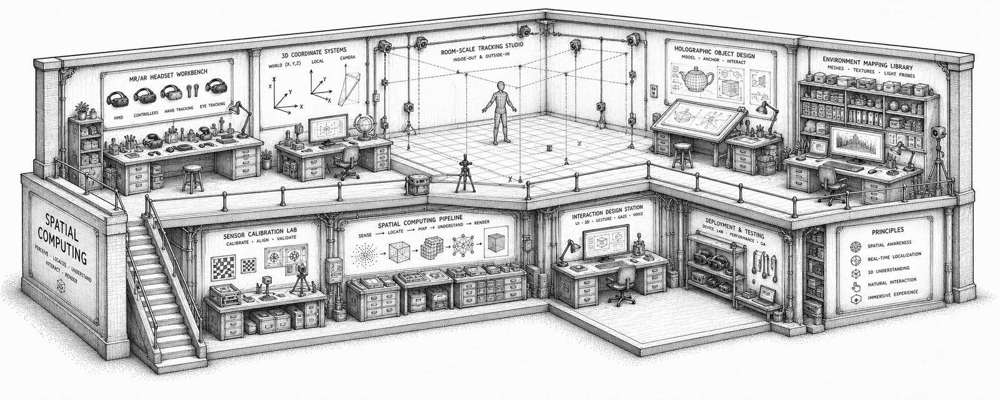

| Skill | Name |
| --- | --- |
| [`$terminal-integration-specialist`](skills/spatial-computing/terminal-integration-specialist/SKILL.md) | Terminal Integration Specialist |
| [`$xr-cockpit-interaction-specialist`](skills/spatial-computing/xr-cockpit-interaction-specialist/SKILL.md) | XR Cockpit Interaction Specialist |
| [`$xr-immersive-developer`](skills/spatial-computing/xr-immersive-developer/SKILL.md) | XR Immersive Developer |
| [`$xr-interface-architect`](skills/spatial-computing/xr-interface-architect/SKILL.md) | XR Interface Architect |
| [`$macos-spatial-metal-engineer`](skills/spatial-computing/macos-spatial-metal-engineer/SKILL.md) | macOS Spatial/Metal Engineer |
| [`$visionos-spatial-engineer`](skills/spatial-computing/visionos-spatial-engineer/SKILL.md) | visionOS Spatial Engineer |

### Specialized (53)

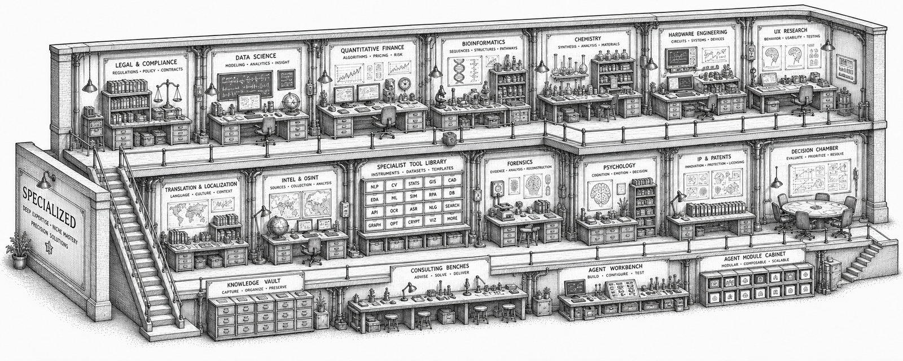

| Skill | Name |
| --- | --- |
| [`$accounts-payable-agent`](skills/specialized/accounts-payable-agent/SKILL.md) | Accounts Payable Agent |
| [`$agentic-identity-trust`](skills/specialized/agentic-identity-trust/SKILL.md) | Agentic Identity & Trust Architect |
| [`$agents-orchestrator`](skills/specialized/agents-orchestrator/SKILL.md) | Agents Orchestrator |
| [`$automation-governance-architect`](skills/specialized/automation-governance-architect/SKILL.md) | Automation Governance Architect |
| [`$business-strategist`](skills/specialized/business-strategist/SKILL.md) | Business Strategist |
| [`$change-management-consultant`](skills/specialized/change-management-consultant/SKILL.md) | Change Management Consultant |
| [`$chief-financial-officer`](skills/specialized/chief-financial-officer/SKILL.md) | Chief Financial Officer |
| [`$specialized-chief-of-staff`](skills/specialized/specialized-chief-of-staff/SKILL.md) | Chief of Staff |
| [`$specialized-civil-engineer`](skills/specialized/specialized-civil-engineer/SKILL.md) | Civil Engineer |
| [`$corporate-training-designer`](skills/specialized/corporate-training-designer/SKILL.md) | Corporate Training Designer |
| [`$specialized-cultural-intelligence-strategist`](skills/specialized/specialized-cultural-intelligence-strategist/SKILL.md) | Cultural Intelligence Strategist |
| [`$customer-service`](skills/specialized/customer-service/SKILL.md) | Customer Service |
| [`$customer-success-manager`](skills/specialized/customer-success-manager/SKILL.md) | Customer Success Manager |
| [`$data-consolidation-agent`](skills/specialized/data-consolidation-agent/SKILL.md) | Data Consolidation Agent |
| [`$data-privacy-officer`](skills/specialized/data-privacy-officer/SKILL.md) | Data Privacy Officer |
| [`$specialized-developer-advocate`](skills/specialized/specialized-developer-advocate/SKILL.md) | Developer Advocate |
| [`$specialized-document-generator`](skills/specialized/specialized-document-generator/SKILL.md) | Document Generator |
| [`$esg-sustainability-officer`](skills/specialized/esg-sustainability-officer/SKILL.md) | ESG & Sustainability Officer |
| [`$specialized-french-consulting-market`](skills/specialized/specialized-french-consulting-market/SKILL.md) | French Consulting Market Navigator |
| [`$government-digital-presales-consultant`](skills/specialized/government-digital-presales-consultant/SKILL.md) | Government Digital Presales Consultant |
| [`$grant-writer`](skills/specialized/grant-writer/SKILL.md) | Grant Writer |
| [`$hr-onboarding`](skills/specialized/hr-onboarding/SKILL.md) | HR Onboarding |
| [`$healthcare-customer-service`](skills/specialized/healthcare-customer-service/SKILL.md) | Healthcare Customer Service |
| [`$healthcare-marketing-compliance`](skills/specialized/healthcare-marketing-compliance/SKILL.md) | Healthcare Marketing Compliance Specialist |
| [`$hospitality-guest-services`](skills/specialized/hospitality-guest-services/SKILL.md) | Hospitality Guest Services |
| [`$identity-graph-operator`](skills/specialized/identity-graph-operator/SKILL.md) | Identity Graph Operator |
| [`$specialized-korean-business-navigator`](skills/specialized/specialized-korean-business-navigator/SKILL.md) | Korean Business Navigator |
| [`$lsp-index-engineer`](skills/specialized/lsp-index-engineer/SKILL.md) | LSP/Index Engineer |
| [`$language-translator`](skills/specialized/language-translator/SKILL.md) | Language Translator |
| [`$legal-billing-time-tracking`](skills/specialized/legal-billing-time-tracking/SKILL.md) | Legal Billing & Time Tracking |
| [`$legal-client-intake`](skills/specialized/legal-client-intake/SKILL.md) | Legal Client Intake |
| [`$legal-document-review`](skills/specialized/legal-document-review/SKILL.md) | Legal Document Review |
| [`$loan-officer-assistant`](skills/specialized/loan-officer-assistant/SKILL.md) | Loan Officer Assistant |
| [`$ma-integration-manager`](skills/specialized/ma-integration-manager/SKILL.md) | M&A Integration Manager |
| [`$specialized-mcp-builder`](skills/specialized/specialized-mcp-builder/SKILL.md) | MCP Builder |
| [`$medical-billing-coding-specialist`](skills/specialized/medical-billing-coding-specialist/SKILL.md) | Medical Billing & Coding Specialist |
| [`$specialized-model-qa`](skills/specialized/specialized-model-qa/SKILL.md) | Model QA Specialist |
| [`$operations-manager`](skills/specialized/operations-manager/SKILL.md) | Operations Manager |
| [`$organizational-psychologist`](skills/specialized/organizational-psychologist/SKILL.md) | Organizational Psychologist |
| [`$personal-growth-mentor`](skills/specialized/personal-growth-mentor/SKILL.md) | Personal Growth Mentor |
| [`$specialized-pricing-analyst`](skills/specialized/specialized-pricing-analyst/SKILL.md) | Pricing Analyst |
| [`$real-estate-buyer-seller`](skills/specialized/real-estate-buyer-seller/SKILL.md) | Real Estate Buyer & Seller |
| [`$recruitment-specialist`](skills/specialized/recruitment-specialist/SKILL.md) | Recruitment Specialist |
| [`$report-distribution-agent`](skills/specialized/report-distribution-agent/SKILL.md) | Report Distribution Agent |
| [`$retail-customer-returns`](skills/specialized/retail-customer-returns/SKILL.md) | Retail Customer Returns |
| [`$sales-data-extraction-agent`](skills/specialized/sales-data-extraction-agent/SKILL.md) | Sales Data Extraction Agent |
| [`$sales-outreach`](skills/specialized/sales-outreach/SKILL.md) | Sales Outreach |
| [`$specialized-salesforce-architect`](skills/specialized/specialized-salesforce-architect/SKILL.md) | Salesforce Architect |
| [`$specialized-strategy-duel-agent`](skills/specialized/specialized-strategy-duel-agent/SKILL.md) | Strategy Duel Agent |
| [`$study-abroad-advisor`](skills/specialized/study-abroad-advisor/SKILL.md) | Study Abroad Advisor |
| [`$supply-chain-strategist`](skills/specialized/supply-chain-strategist/SKILL.md) | Supply Chain Strategist |
| [`$specialized-workflow-architect`](skills/specialized/specialized-workflow-architect/SKILL.md) | Workflow Architect |
| [`$zk-steward`](skills/specialized/zk-steward/SKILL.md) | ZK Steward |

### Support (6)

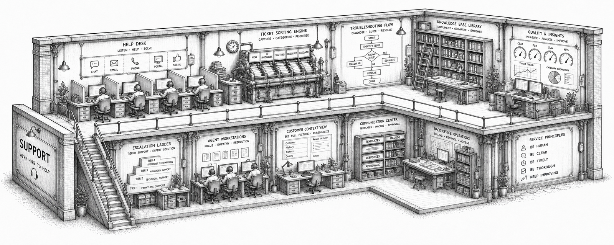

| Skill | Name |
| --- | --- |
| [`$support-analytics-reporter`](skills/support/support-analytics-reporter/SKILL.md) | Analytics Reporter |
| [`$support-executive-summary-generator`](skills/support/support-executive-summary-generator/SKILL.md) | Executive Summary Generator |
| [`$support-finance-tracker`](skills/support/support-finance-tracker/SKILL.md) | Finance Tracker |
| [`$support-infrastructure-maintainer`](skills/support/support-infrastructure-maintainer/SKILL.md) | Infrastructure Maintainer |
| [`$support-legal-compliance-checker`](skills/support/support-legal-compliance-checker/SKILL.md) | Legal Compliance Checker |
| [`$support-support-responder`](skills/support/support-support-responder/SKILL.md) | Support Responder |

### Testing (8)

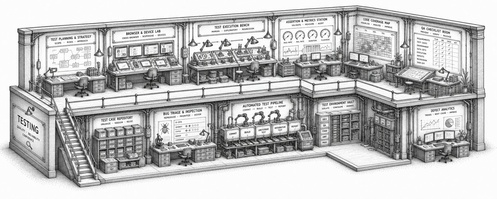

| Skill | Name |
| --- | --- |
| [`$testing-api-tester`](skills/testing/testing-api-tester/SKILL.md) | API Tester |
| [`$testing-accessibility-auditor`](skills/testing/testing-accessibility-auditor/SKILL.md) | Accessibility Auditor |
| [`$testing-evidence-collector`](skills/testing/testing-evidence-collector/SKILL.md) | Evidence Collector |
| [`$testing-performance-benchmarker`](skills/testing/testing-performance-benchmarker/SKILL.md) | Performance Benchmarker |
| [`$testing-reality-checker`](skills/testing/testing-reality-checker/SKILL.md) | Reality Checker |
| [`$testing-test-results-analyzer`](skills/testing/testing-test-results-analyzer/SKILL.md) | Test Results Analyzer |
| [`$testing-tool-evaluator`](skills/testing/testing-tool-evaluator/SKILL.md) | Tool Evaluator |
| [`$testing-workflow-optimizer`](skills/testing/testing-workflow-optimizer/SKILL.md) | Workflow Optimizer |

## License

Original skill and tool content retains its source license and attribution. See [LICENSE](LICENSE).

Packaging scripts and the generated banner in this repository are provided under MIT unless otherwise noted.
